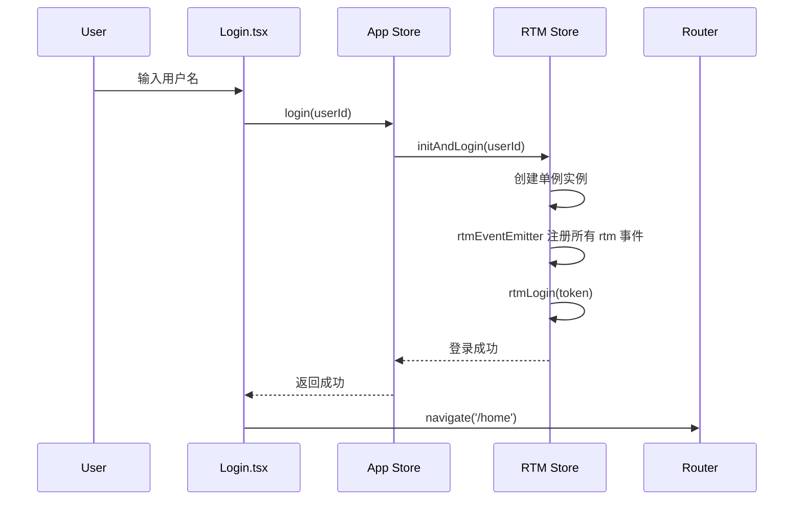
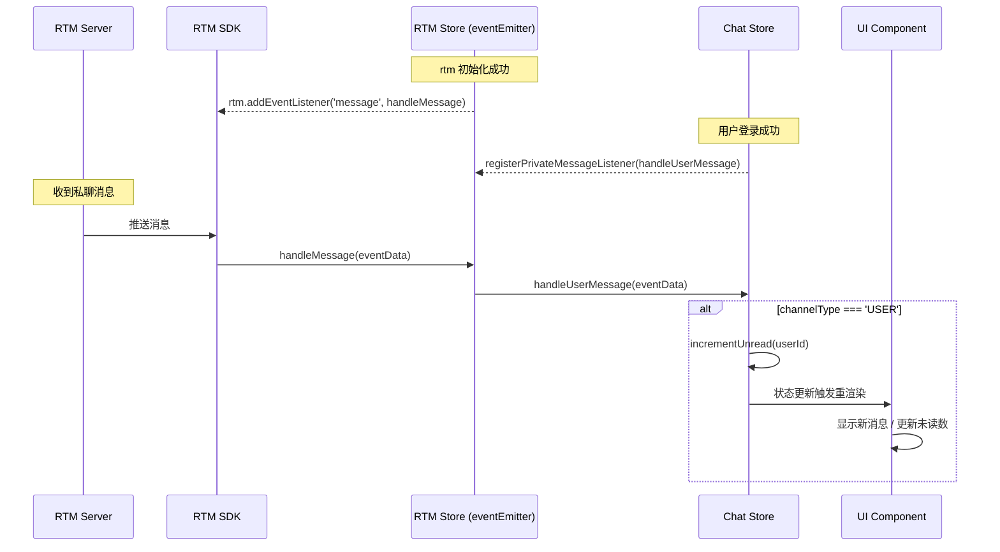
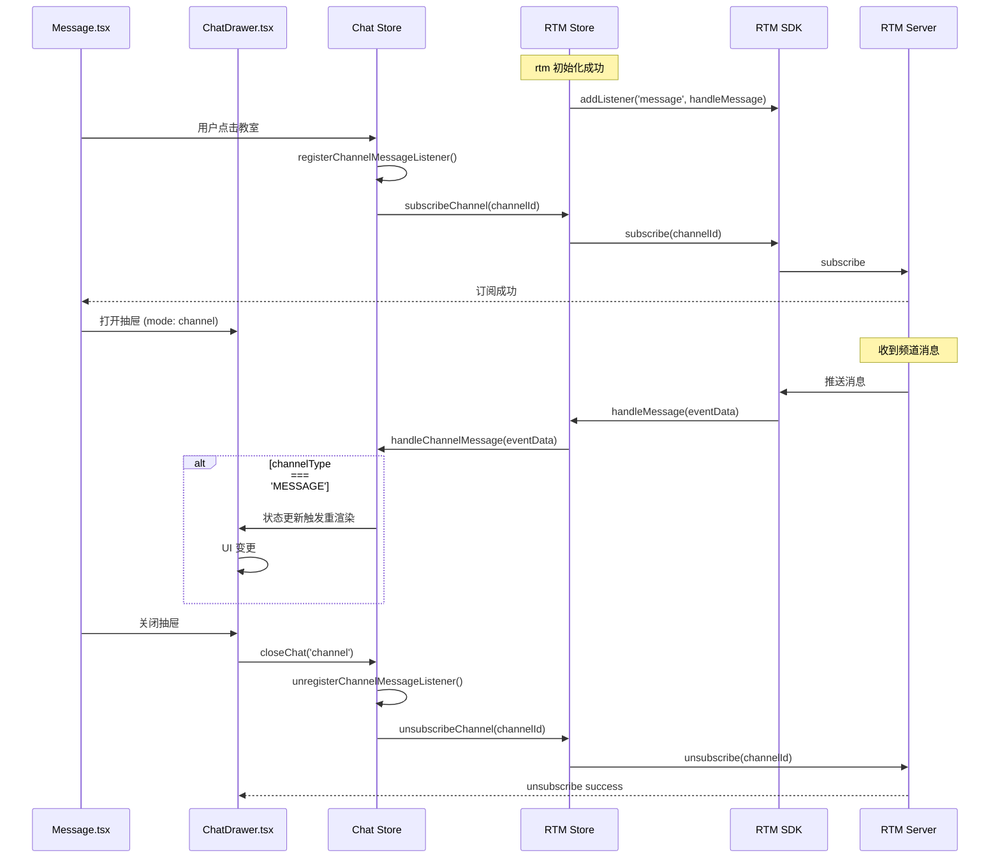
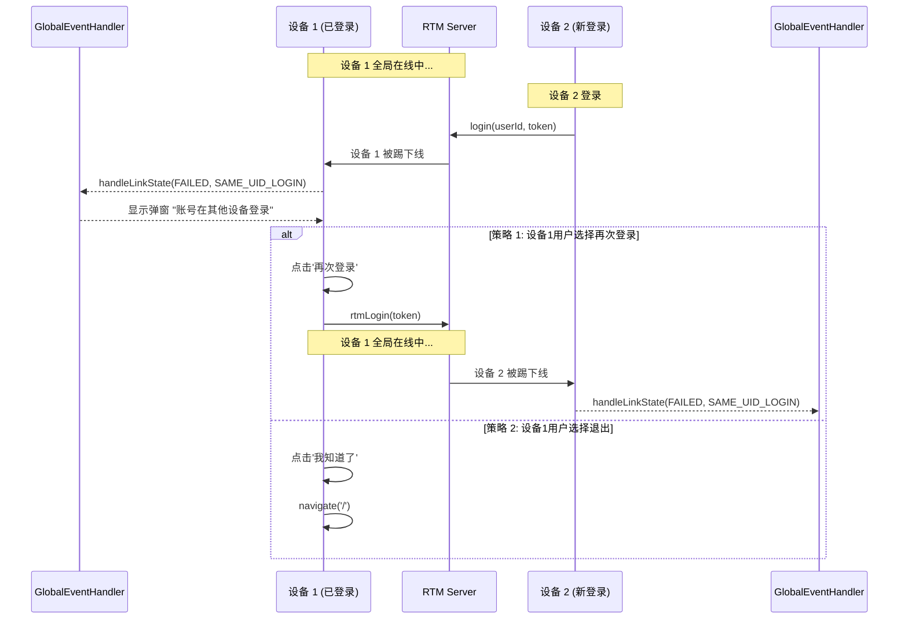

# H5 项目 RTM 集成文档

本文档说明 H5（React + Vite）项目集成 Agora RTM SDK 的架构设计和实现细节。

---

## 1. 概述

### 1.1 核心目标

- ✅ **单例管理**：全局唯一 RTM 实例，避免多个实例重复登录引发未知问题
- ✅ **事件集中处理**：统一事件监听和分发机制
- ✅ **连接状态同步**：跨组件的消息和连接状态管理
- ✅ **防止互踢**：正确处理 `SAME_UID_LOGIN` 事件

### 1.2 技术栈

- **框架**：React 18
- **状态管理**：Jotai
- **路由**：React Router 6
- **构建工具**：Vite 5
- **RTM SDK**：agora-rtm

---

## 2. 分层架构

### 2.1 架构图

```
┌─────────────────────────────────────────────────────────────────┐
│                    UI Layer (Pages & Components)                │
│  ┌──────────────┐  ┌──────────────┐  ┌──────────────┐           │
│  │  Login.tsx   │  │  Home.tsx    │  │ Message.tsx  │           │
│  │  (登录页)     │  │  (首页)       │  │ (消息页)      │           │
│  └──────────────┘  └──────────────┘  └──────┬───────┘           │
│                                             │                   │
│  ┌──────────────────────────────────────────┼──────────────┐    │
│  │  App.tsx（全局布局）                       │              │    │
│  │  ┌────────────────┐  ┌───────────────────▼──────────┐   │    │
│  │  │ Navbar.tsx     │  │ GlobalEventHandler.tsx       │   │    │
│  │  │ （登出/导航）    │  │ （互踢 / Token 过期 /私聊监听）  │  │    │
│  │  └────────────────┘  └──────────────────────────────┘   │    │
│  └─────────────────────────────────────────────────────────┘    │
└─────────┼───────────────────────────────────────┼───────────────┘
          │                                       │
┌─────────┼───────────────────────────────────────┼────────────────┐
│         │    State Layer (Jotai Atoms + Store)  │                │
│  ┌──────▼───────┐  ┌──────────────┐  ┌──────────▼─────┐          │
│  │  App Store   │  │  User Atoms  │  │  Chat Store    │          │
│  │  (登录/登出)  │  │  (用户状态)   │   │  (消息/业务)    │          │
│  └──────┬───────┘  └──────────────┘  └─────────┬──────┘          │
│         │                                      │                 │
│  ┌──────▼──────────────────────────────────────▼──────┐          │
│  │              RTM Store（薄封装层）                   │          │
│  │  - 事件监听器注册/清理                                │          │
│  │  - RTM 操作封装（消息 / 订阅 / 登录 / 登出）           │           │
│  │  - 状态检查                                         │          │
│  └──────┬──────────────────────────────────────────────┘         │
└─────────┼────────────────────────────────────────────────────────┘
          │
┌─────────▼────────────────────────────────────────────────────────┐
│              RTM Layer (shared/rtm)                              │
│  ┌──────────────┐  ┌──────────────┐  ┌──────────────┐            │
│  │ RTM Client   │  │ Event Emitter│  │ Message API  │            │
│  │  (Singleton) │  │  (EventBus)  │  │ Channel API  │            │
│  └──────────────┘  └──────────────┘  └──────────────┘            │
└──────────────────────────────────────────────────────────────────┘
```

### 2.2 核心组件

| 组件                       | 职责                                       | 位置                                |
| -------------------------- | ------------------------------------------ | ----------------------------------- |
| **RTM Store**              | RTM 操作薄封装层（提供事件监听注册）       | `store/rtm.ts`                      |
| **App Store**              | 应用级状态管理（登录/登出）                | `store/app.ts`                      |
| **Chat Store**             | 消息状态管理 + 业务逻辑                    | `store/chat.ts`                     |
| **User Atoms**             | 用户状态管理                               | `store/user.ts`                     |
| **GlobalEventHandler.tsx** | 全局事件处理（互踢/Token 过期/私聊监听）   | `components/GlobalEventHandler.tsx` |
| **Navbar.tsx**             | 全局导航栏（登出）                         | `components/Navbar.tsx`             |

### 2.3 消息监听策略 ⭐

本架构采用**分层监听策略**，根据消息类型的特点采用不同的监听生命周期：

| 消息类型               | 监听时机       | 生命周期             | 注册位置                            | 处理函数               |
| -------------------- | -------------- | ----------------- | ----------------------------------- | ---------------------- |
| **私有消息 (USER)**    | 登录成功后     | 伴随 App 生命周期    | `components/GlobalEventHandler.tsx` | `handleUserMessage`    |
| **频道消息 (MESSAGE)** | 打开频道聊天时 | 仅在聊天窗口打开期间 | `store/chat.ts` (openChannelChat)   | `handleChannelMessage` |

#### 设计理由

**私有消息 - 全局监听**：

- ✅ 用户随时可能收到私聊消息
- ✅ 需要实时更新未读数和消息列表
- ✅ 即使用户不在聊天界面，也要接收并存储消息
- ✅ 在 GlobalEventHandler 中注册，伴随 App 生命周期

**频道消息 - 按需监听**：

- ✅ 仅在用户主动进入频道时才需要接收
- ✅ 离开频道后取消监听，节省资源
- ✅ 避免接收用户未订阅频道的消息
- ✅ 在 Chat Store 的 openChannelChat 方法中注册，closeChat 时清理

#### 实现示例

```typescript
// 1. GlobalEventHandler - 注册私有消息监听（全局生命周期）
// components/GlobalEventHandler.tsx
export default function GlobalEventHandler() {
  const registerListeners = useCallback(() => {
    // 注入 Jotai setters 到 chatStore
    chatStore.injectSetters({
      addPrivateMessage,
      addChannelMessage,
      incrementUnread,
      clearUnread,
      setCurrentChannelId,
      currentUserId: userId,
    });

    // 1. 注册私有消息监听（全局生命周期）
    chatStore.registerPrivateMessageListener();

    // 2. 注册 linkState 监听（处理互踢/Token过期）
    rtmStore.registerLinkStateListener(handleLinkState);
  }, [/* deps */]);

  useEffect(() => {
    if (location.pathname !== "/") {
      registerListeners();
    }

    return () => {
      chatStore.unregisterPrivateMessageListener();
      rtmStore.unregisterLinkStateListener(handleLinkState);
    };
  }, [location.pathname, registerListeners]);
}
```

```typescript
// 2. Chat Store - 打开频道聊天时注册频道消息监听
// store/chat.ts
async openChannelChat(channelId: string): Promise<void> {
  // 1. 注册监听器
  this.registerChannelMessageListener();

  // 2. 订阅频道
  await rtmStore.subscribeChannel(channelId);

  // 3. 记录当前频道
  if (this.setCurrentChannelIdFn) {
    this.setCurrentChannelIdFn(channelId);
  }
}

// 3. Chat Store - 关闭聊天时清理频道消息监听
async closeChat(mode: "private" | "channel", currentChannelId: string | null): Promise<void> {
  if (mode === "channel" && currentChannelId) {
    // 先取消监听器
    this.unregisterChannelMessageListener();

    // 取消订阅频道
    await rtmStore.unsubscribeChannel(currentChannelId);

    // 清空当前频道
    if (this.setCurrentChannelIdFn) {
      this.setCurrentChannelIdFn(null);
    }
  }
}
```

---

## 3. 流程图

### 3.1 登录流程



### 3.2 私有消息接收流程



### 3.3 频道消息接收流程



### 3.4 多端互踢处理流程



---

## 4. Vite 配置

### 4.1 环境变量配置

H5 项目使用 Vite 的 `VITE_*` 环境变量：

```bash
# .env
VITE_APP_ID=your_app_id
VITE_APP_CERT=your_app_cert
```

### 4.2 Vite 配置示例

```typescript
// vite.config.ts
import { defineConfig } from 'vite';
import react from '@vitejs/plugin-react';

export default defineConfig({
  plugins: [react()],
  optimizeDeps: {
    include: ['events'],
  },
});
```

---

## 5. 关键设计决策

### 5.1 RTM Store - 薄封装层

**位置**：`store/rtm.ts`

```typescript
// store/rtm.ts
import { atom } from "jotai";
import {
  initRtm,
  releaseRtm,
  rtmLogin as rtmSdkLogin,
  subscribeChannel as rtmSubscribeChannel,
  unsubscribeChannel as rtmUnsubscribeChannel,
  sendMessageToUser as rtmSendMessageToUser,
  sendChannelMessage as rtmSendChannelMessage,
  rtmEventEmitter,
  getGlobalRtmClient,
} from "../../../shared/rtm";
import type { RTMEvents } from "agora-rtm";

// RTM 状态 atoms
export const isRtmInitializedAtom = atom(false);
export const isRtmLoggedInAtom = atom(false);

// RTM Store 类（单例模式）
class RtmStore {
  private static instance: RtmStore;

  static getInstance(): RtmStore {
    if (!RtmStore.instance) {
      RtmStore.instance = new RtmStore();
    }
    return RtmStore.instance;
  }

  // RTM 初始化和登录
  async initAndLogin(userId: string): Promise<void> {
    const token = await this.generateRTMToken();
    await initRtm(userId, token);
  }

  // 检查 RTM 状态
  checkRtmStatus(): boolean {
    try {
      getGlobalRtmClient();
      return true;
    } catch {
      return false;
    }
  }

  // 事件监听器注册
  registerMessageListener(handler: (eventData: RTMEvents["message"]) => void): void {
    rtmEventEmitter.addListener("message", handler);
  }

  unregisterMessageListener(handler: (eventData: RTMEvents["message"]) => void): void {
    rtmEventEmitter.removeListener("message", handler);
  }

  // 其他 RTM 操作封装...
}

export const rtmStore = RtmStore.getInstance();
```

**设计原则**：

- ✅ **薄封装**：不重新实现逻辑，只是包装 `shared/rtm` 的方法
- ✅ **状态管理**：维护 RTM 连接状态（isInitialized, isLoggedIn）
- ✅ **事件管理**：提供统一的事件监听器注册/清理接口
- ✅ **类型安全**：提供 TypeScript 类型定义

### 5.2 App Store - 应用级状态管理

**位置**：`store/app.ts`

```typescript
// store/app.ts
import { atom } from "jotai";
import { rtmStore } from "./rtm";

// 应用状态 atoms
export const isLoadingAtom = atom(false);
export const isLoggedInAtom = atom(false);

// App Store 类（单例模式）
class AppStore {
  private static instance: AppStore;

  static getInstance(): AppStore {
    if (!AppStore.instance) {
      AppStore.instance = new AppStore();
    }
    return AppStore.instance;
  }

  // 登录
  async login(userId: string): Promise<void> {
    // RTM 初始化和登录
    await rtmStore.initAndLogin(userId);
  }

  // 登出
  async logout(): Promise<void> {
    // RTM 登出
    await rtmStore.logout();
  }
}

export const appStore = AppStore.getInstance();
```

**好处**：

- ✅ **集中管理**：登录/登出逻辑集中在一个地方
- ✅ **UI 简化**：UI 层只需调用 `login()` 和 `logout()`
- ✅ **易于维护**：修改登录流程只需改一个地方

### 5.3 GlobalEventHandler 作为全局事件中心

**位置**：`components/GlobalEventHandler.tsx`

```tsx
// components/GlobalEventHandler.tsx
export default function GlobalEventHandler() {
  const navigate = useNavigate();
  const location = useLocation();
  const [showKickDialog, setShowKickDialog] = useState(false);

  // 处理 linkState 事件（互踢、Token过期）
  const handleLinkState = useCallback(async (eventData: RTMEvents["linkState"]) => {
    const { currentState, reasonCode } = eventData;

    // 处理互踢
    if (currentState === "FAILED" && reasonCode === "SAME_UID_LOGIN") {
      setShowKickDialog(true);
    }

    // 处理 Token 过期
    if (currentState === "FAILED" && reasonCode === "TOKEN_EXPIRED") {
      await rtmStore.rtmLogin();
    }
  }, []);

  useEffect(() => {
    if (location.pathname !== "/") {
      // 1. 注册私有消息监听（全局生命周期）
      chatStore.registerPrivateMessageListener();

      // 2. 注册 linkState 监听（处理互踢/Token过期）
      rtmStore.registerLinkStateListener(handleLinkState);
    }

    return () => {
      chatStore.unregisterPrivateMessageListener();
      rtmStore.unregisterLinkStateListener(handleLinkState);
    };
  }, [location.pathname, handleLinkState]);

  // 渲染互踢对话框...
}
```

**架构**：

- ✅ **全局组件**：在 App.tsx 中引入，伴随应用生命周期
- ✅ **集中处理**：所有全局事件（互踢、Token 过期、私聊监听）在一个组件中管理
- ✅ **自动清理**：组件卸载时自动清理所有监听器

### 5.4 Chat Store 管理业务逻辑

**位置**：`store/chat.ts`

```typescript
// store/chat.ts
import { atom } from "jotai";
import type { Message } from "../types/chat";
import { rtmStore } from "./rtm";

// Jotai atoms
export const privateMessagesAtom = atom<Record<string, Message[]>>({});
export const channelMessagesAtom = atom<Record<string, Message[]>>({});
export const unreadCountsAtom = atom<Record<string, number>>({});
export const currentChannelIdAtom = atom<string | null>(null);

// Chat Store 类（单例模式）- 业务逻辑封装
class ChatStore {
  private static instance: ChatStore;
  private privateMessageHandler: ((eventData: any) => void) | null = null;
  private channelMessageHandler: ((eventData: any) => void) | null = null;

  // Jotai setter 引用（由组件注入）
  private addPrivateMessageFn: ((params: any) => void) | null = null;
  private addChannelMessageFn: ((params: any) => void) | null = null;

  static getInstance(): ChatStore {
    if (!ChatStore.instance) {
      ChatStore.instance = new ChatStore();
    }
    return ChatStore.instance;
  }

  // 注入 Jotai setters（由 GlobalEventHandler 调用）
  injectSetters(setters: { /* ... */ }): void {
    // 保存 setter 引用
  }

  // 业务方法：发送消息
  async sendMessage(targetId: string, content: string, mode: "private" | "channel"): Promise<void> {
    if (mode === "private") {
      await rtmStore.sendPrivateMessage(targetId, content);
      // 更新本地状态
    } else {
      await rtmStore.sendChannelMessage(targetId, content);
      // 频道消息通过监听器自动添加
    }
  }

  // 业务方法：打开频道聊天
  async openChannelChat(channelId: string): Promise<void> {
    this.registerChannelMessageListener();
    await rtmStore.subscribeChannel(channelId);
  }

  // 业务方法：关闭聊天
  async closeChat(mode: "private" | "channel", currentChannelId: string | null): Promise<void> {
    if (mode === "channel" && currentChannelId) {
      this.unregisterChannelMessageListener();
      await rtmStore.unsubscribeChannel(currentChannelId);
    }
  }
}

export const chatStore = ChatStore.getInstance();
```

**好处**：

- ✅ **业务封装**：UI 层不需要知道 RTM 的存在
- ✅ **状态管理**：统一管理消息状态（privateMessages, channelMessages）
- ✅ **逻辑复用**：业务方法可以在多个组件中复用

---

## 6. 防止多端互踢的最佳实践

### 6.1 问题根源

**互踢原因**：

- 每个声网签发的 AppId 下，同一 `userId` 在多个设备/浏览器标签页登录
  - App 初始化页面被执行多次，每次用同一个 userId 创建新的 RTM 实例并登录
  - App 各组件都调用了 rtm login，可能存在同实例在本地多次同时执行 login
- RTM Server 默认只保留最新登录的连接

### 6.2 解决方案

#### 方案 1：单例模式（推荐）

```typescript
// ✅ 正确：全局单例
let globalRtmClient: RTM | null = null;

export function initRtm(appId: string, userId: string): RTM {
  if (globalRtmClient) {
    console.log("RTM client already exists, reusing...");
    return globalRtmClient;
  }
  globalRtmClient = new RTM(appId, userId);
  return globalRtmClient;
}

// ❌ 错误：每次都创建新实例
export function initRtm(appId: string, userId: string): RTM {
  return new RTM(appId, userId); // 可能导致互踢！
}
```

#### 方案 2：检测并处理 SAME_UID_LOGIN

```tsx
// components/GlobalEventHandler.tsx
const handleLinkState = useCallback(async (eventData: RTMEvents["linkState"]) => {
  if (eventData.currentState === "FAILED") {
    if (eventData.reasonCode === "SAME_UID_LOGIN") {
      // 显示对话框让用户选择
      setShowKickDialog(true);
    }
  }
}, []);

const handleRelogin = async () => {
  // 策略 A：保留当前设备，重新登录
  await rtmStore.rtmLogin();
  setShowKickDialog(false);
};

const handleDismiss = () => {
  // 策略 B：保留新设备，退出当前设备
  setShowKickDialog(false);
  navigate("/");
};
```

---

## 7. 目录结构

```
demos/h5/
├── src/
│   ├── App.tsx                         # 根布局（集成 GlobalEventHandler 和 Navbar）
│   ├── main.tsx                        # 入口文件
│   │
│   ├── pages/
│   │   ├── Login.tsx                   # 登录页（初始化并登录 RTM）
│   │   ├── Home.tsx                    # Home 页面
│   │   ├── Message.tsx                 # Message 页面（聊天功能）⭐
│   │   └── More.tsx                    # More 页面
│   │
│   ├── components/
│   │   ├── GlobalEventHandler.tsx      # 全局事件处理（互踢/Token过期/私聊监听）⭐
│   │   ├── Navbar.tsx                  # 全局导航栏（登出）
│   │   ├── ChatDrawer.tsx              # 聊天抽屉组件
│   │   ├── ClassroomList.tsx           # 教室列表组件
│   │   ├── TeacherList.tsx             # 教师列表组件
│   │   └── StudentList.tsx             # 学生列表组件
│   │
│   ├── store/
│   │   ├── app.ts                      # 应用状态（登录/登出）⭐
│   │   ├── rtm.ts                      # RTM 操作薄封装层 ⭐
│   │   ├── chat.ts                     # 消息状态 + 消息处理器 ⭐
│   │   └── user.ts                     # 用户状态
│   │
│   ├── types/
│   │   ├── chat.ts                     # 聊天相关类型
│   │   └── user.ts                     # 用户相关类型
│   │
│   └── mocks/
│       └── data.ts                     # Mock 数据
│
├── docs/
│   └── H5_RTM_INTEGRATION.md           # 本文档
│
├── vite.config.ts                      # Vite 配置
├── tsconfig.json                       # TypeScript 配置
├── package.json                        # 项目依赖
└── .env.example                        # 环境变量示例
```

**关键文件**：

- ⭐ `components/GlobalEventHandler.tsx`：全局互踢事件处理组件
- ⭐ `pages/Message.tsx`：消息页面，业务层订阅事件
- ⭐ `store/rtm.ts`：RTM 操作薄封装层，提供事件监听注册
- ⭐ `store/app.ts`：应用级状态管理（登录/登出）
- ⭐ `store/chat.ts`：消息状态管理 + 消息处理函数

---

## 8. 使用示例

### 8.1 登录页 - 初始化 RTM

```tsx
// pages/Login.tsx
import { useState } from "react";
import { useNavigate } from "react-router-dom";
import { useAtom } from "jotai";
import { userIdAtom, userRoleAtom } from "../store/user";
import { appStore } from "../store/app";

export default function Login() {
  const navigate = useNavigate();
  const [userId, setUserId] = useAtom(userIdAtom);
  const [loading, setLoading] = useState(false);
  const [error, setError] = useState("");

  const handleLogin = async (e: React.FormEvent) => {
    e.preventDefault();

    if (!userId.trim()) {
      setError("Please enter a username");
      return;
    }

    try {
      setLoading(true);
      setError("");

      // 调用 App Store 的 login 方法
      await appStore.login(userId);

      // 跳转到主页
      navigate("/home");
    } catch (err) {
      setError("Login failed. Please try again.");
      console.error(err);
    } finally {
      setLoading(false);
    }
  };

  return (
    <form onSubmit={handleLogin}>
      <input value={userId} onChange={(e) => setUserId(e.target.value)} />
      <button type="submit" disabled={loading}>Login</button>
    </form>
  );
}
```

### 8.2 App.tsx - 集成全局组件

```tsx
// App.tsx
import { BrowserRouter, Routes, Route, Navigate } from "react-router-dom";
import { Provider } from "jotai";
import Login from "./pages/Login";
import Home from "./pages/Home";
import Message from "./pages/Message";
import More from "./pages/More";
import Navbar from "./components/Navbar";
import GlobalEventHandler from "./components/GlobalEventHandler";

function ProtectedRoute({ children }: { children: React.ReactNode }) {
  return rtmStore.checkRtmStatus() ? <>{children}</> : <Navigate to="/" replace />;
}

function App() {
  return (
    <Provider>
      <BrowserRouter>
        {/* ⭐ 全局事件处理（私聊监听、互踢、Token过期） */}
        <GlobalEventHandler />
        <Routes>
          <Route path="/" element={<Login />} />
          <Route
            path="/home"
            element={
              <ProtectedRoute>
                <div className="app-layout">
                  <Home />
                  {/* ⭐ 全局导航栏（登录后显示） */}
                  <Navbar />
                </div>
              </ProtectedRoute>
            }
          />
          {/* ... 其他路由 */}
        </Routes>
      </BrowserRouter>
    </Provider>
  );
}
```

### 8.3 Message 页 - 使用 Chat Store

```tsx
// pages/Message.tsx
import { useState, useEffect } from "react";
import { useNavigate } from "react-router-dom";
import { useAtomValue, useAtom } from "jotai";
import { userIdAtom, userRoleAtom } from "../store/user";
import { currentChannelIdAtom, chatStore } from "../store/chat";
import { rtmStore } from "../store/rtm";

export default function Message() {
  const navigate = useNavigate();
  const userId = useAtomValue(userIdAtom);
  const [currentChannelId, setCurrentChannelId] = useAtom(currentChannelIdAtom);

  useEffect(() => {
    // 检查 RTM 状态
    if (!rtmStore.checkRtmStatus()) {
      navigate("/");
    }
  }, [navigate]);

  const handlePrivateChatClick = (user: User) => {
    // 打开私聊（清零未读数）
    chatStore.openPrivateChat(user.userId);
    // 更新 UI 状态...
  };

  const handleClassroomClick = async (classroom: Classroom) => {
    try {
      // 打开频道聊天（订阅 + 注册监听器）
      await chatStore.openChannelChat(classroom.id);
      setCurrentChannelId(classroom.id);
      // 更新 UI 状态...
    } catch (error) {
      console.error("Failed to open channel chat:", error);
    }
  };

  const handleCloseDrawer = async () => {
    try {
      // 关闭聊天（取消订阅 + 清理监听器）
      await chatStore.closeChat(drawerState.mode, currentChannelId);
      setCurrentChannelId(null);
      // 更新 UI 状态...
    } catch (error) {
      console.error("Failed to close chat:", error);
    }
  };

  const handleSendMessage = async (content: string) => {
    try {
      // 发送消息（通过 Chat Store）
      await chatStore.sendMessage(drawerState.targetId, content, drawerState.mode);
    } catch (error) {
      console.error("Failed to send message:", error);
    }
  };

  return <div>Message Content</div>;
}
```

**注意**：

- ✅ UI 层不直接调用 RTM API
- ✅ 所有操作通过 Chat Store 完成
- ✅ Chat Store 内部调用 RTM Store

### 8.4 ChatDrawer - 纯展示组件

```tsx
// components/ChatDrawer.tsx
import { useState, useEffect, useRef } from "react";
import { useAtomValue } from "jotai";
import type { ChatDrawerState } from "../types/chat";
import { privateMessagesAtom, channelMessagesAtom } from "../store/chat";

export default function ChatDrawer({
  state,
  currentUserId,
  onClose,
  onSendMessage,
}: ChatDrawerProps) {
  const [inputValue, setInputValue] = useState("");
  const messagesEndRef = useRef<HTMLDivElement>(null);

  const privateMessages = useAtomValue(privateMessagesAtom);
  const channelMessages = useAtomValue(channelMessagesAtom);

  const messages =
    state.mode === "private"
      ? privateMessages[state.targetId] || []
      : channelMessages[state.targetId] || [];

  // 自动滚动到底部
  useEffect(() => {
    messagesEndRef.current?.scrollIntoView({ behavior: "smooth" });
  }, [messages]);

  const handleSend = () => {
    if (!inputValue.trim()) return;
    onSendMessage(inputValue.trim());
    setInputValue("");
  };

  return (
    <div className="chat-drawer">
      <div className="messages">
        {messages.map((msg) => (
          <div key={msg.id}>{msg.content}</div>
        ))}
        <div ref={messagesEndRef} />
      </div>

      <div className="input-area">
        <input
          value={inputValue}
          onChange={(e) => setInputValue(e.target.value)}
        />
        <button onClick={handleSend}>Send</button>
      </div>
    </div>
  );
}
```

**注意**：

- ✅ 纯展示组件，不包含任何 RTM 逻辑
- ✅ 通过 props 接收回调函数
- ✅ 从 Jotai atoms 读取消息状态

### 8.5 Navbar - 登出处理

```tsx
// components/Navbar.tsx
import { NavLink, useNavigate } from "react-router-dom";
import { appStore } from "../store/app";

export default function Navbar() {
  const navigate = useNavigate();

  const handleLogout = async () => {
    try {
      // 调用 App Store 的 logout 方法
      await appStore.logout();
      navigate("/");
    } catch (error) {
      console.error("Logout failed:", error);
      navigate("/");
    }
  };

  return (
    <nav className="navbar">
      <div className="navbar-menu">
        <NavLink to="/home">Home</NavLink>
        <NavLink to="/message">Message</NavLink>
        <NavLink to="/more">More</NavLink>
      </div>

      <div className="navbar-footer">
        <button onClick={handleLogout}>Logout</button>
      </div>
    </nav>
  );
}
```

**注意**：

- ✅ UI 层只调用 App Store 的 logout 方法
- ✅ App Store 内部处理所有清理逻辑（取消监听、登出 RTM、清理存储）

---

## 9. 常见问题

### Q1: 为什么私有消息和频道消息要分开监听？

基于不同的业务需求和生命周期：

- **私有消息**：用户随时可能收到，需要全局监听以实时更新未读数
- **频道消息**：仅在用户主动进入频道时才需要，按需监听节省资源

这种设计符合用户预期，也更高效。

### Q2: 为什么要使用 EventEmitter？

解耦 SDK 和业务逻辑。

- RTM SDK 的事件监听器是全局的，直接在组件中注册会导致重复注册
- EventEmitter 作为中间层，允许多个组件订阅同一事件
- 组件卸载时可以安全地取消订阅，不影响其他组件

### Q3: 如何避免多端互踢？

三个关键点：

1. 使用单例模式，全局只创建一个 RTM 实例
2. **监听 `linkState` 事件，检测 `SAME_UID_LOGIN`**
3. 页面切换时复用实例，不要重复登录（使用 rtmStore 即可保证）

### Q4: Jotai 与 Zustand 的区别？

| 特性           | Jotai                       | Zustand                    |
| -------------- | --------------------------- | -------------------------- |
| **设计理念**   | 原子化状态                  | 单一 Store                 |
| **状态定义**   | `atom()`                    | `create()`                 |
| **状态读取**   | `useAtomValue()`            | `useStore(selector)`       |
| **状态更新**   | `useSetAtom()`              | `useStore(s => s.action)`  |
| **派生状态**   | 派生 atom                   | selector                   |
| **适用场景**   | 细粒度状态管理              | 集中式状态管理             |

H5 项目使用 Jotai 的原因：

- 更细粒度的状态管理，避免不必要的重渲染
- 与 React 的 Suspense 和 Concurrent 特性更好集成
- 更简单的 API，学习曲线较低

### Q5: 与 Nuxt/Next.js 项目的主要区别？

| 特性           | H5 (React)                  | Nuxt 3                     | Next.js                    |
| -------------- | --------------------------- | -------------------------- | -------------------------- |
| **状态管理**   | Jotai (`atom`)              | Pinia (`defineStore`)      | Zustand (`create`)         |
| **SSR 处理**   | 无 SSR                      | `ssr: false` 全局禁用      | `'use client'` 按组件标记  |
| **环境变量**   | `VITE_*` 前缀               | `VITE_*` 前缀              | `NEXT_PUBLIC_*` 前缀       |
| **路由**       | React Router 6              | 文件系统路由               | 文件系统路由               |
| **组件语法**   | React JSX                   | Vue SFC                    | React JSX                  |
| **生命周期**   | `useEffect`                 | `onMounted` / `onUnmounted`| `useEffect`                |
| **响应式状态** | `useState` / Jotai atoms    | `ref()` / `reactive()`     | `useState`                 |

---

## 10. 总结

### 10.1 架构优势

| 优势             | 说明                                                                 |
| ---------------- | -------------------------------------------------------------------- |
| **单例管理**     | 全局唯一 RTM 实例，避免重复登录和互踢                                |
| **分层监听**     | 私有消息全局监听，频道消息按需监听                                   |
| **事件解耦**     | EventEmitter 解耦 SDK 和业务，灵活订阅                               |
| **集中处理**     | 所有 RTM SDK 事件在 `rtm-events.ts` 中统一注册，由 EventEmitter 派发 |
| **状态同步**     | Jotai 跨组件共享消息状态                                             |
| **生命周期清晰** | 组件级别的事件订阅，自动清理                                         |
| **资源优化**     | 按需监听频道消息，节省资源                                           |
| **易于测试**     | 业务逻辑和 SDK 分离，便于 Mock 测试                                  |

### 10.2 最佳实践清单

**RTM 实例管理**：

- ✅ 使用单例模式管理 RTM 实例
- ✅ 在 `shared/rtm/rtm-events.ts` 中注册全局事件监听器
- ✅ 页面切换时复用实例，不要重复登录
- ✅ **使用 GlobalEventHandler 组件全局监听 `linkState` 事件处理互踢**
- ✅ 在 App.tsx 中引入 GlobalEventHandler，所有页面自动生效
- ✅ 收到掉线通知时，提供用户选择："我知道了，回到首页" 或 "再次登录"

**消息监听策略**：

- ✅ 私有消息在登录成功后立即注册全局监听
- ✅ 频道消息订阅频道时按需监听
- ✅ 组件卸载时取消事件订阅，防止内存泄漏
- ✅ 使用不同的处理函数区分消息类型

### 10.3 架构图总结

```
登录流程：
Login Page → rtm 封装层: initRtm() / 注册全局监听 → 业务层: 注册私有消息监听 / 注册互踢掉线监听 → Home Page

全局互踢处理：
GlobalEventHandler (App.tsx) → 监听 linkState → 检测 SAME_UID_LOGIN → 显示对话框

私有消息流程：
RTM Server → SDK → SDK Events → EventEmitter → handleUserMessage → Chat Store → UI

频道消息流程：
打开频道 → 注册频道消息监听 → subscribeChannel() →
RTM Server → SDK → SDK Events → EventEmitter → handleChannelMessage → Chat Store → UI →
关闭频道 → 取消监听 → unsubscribeChannel()
```

---

**文档版本**：v1.0  
**最后更新**：2026-02-25  
**维护者**：AI Agent
