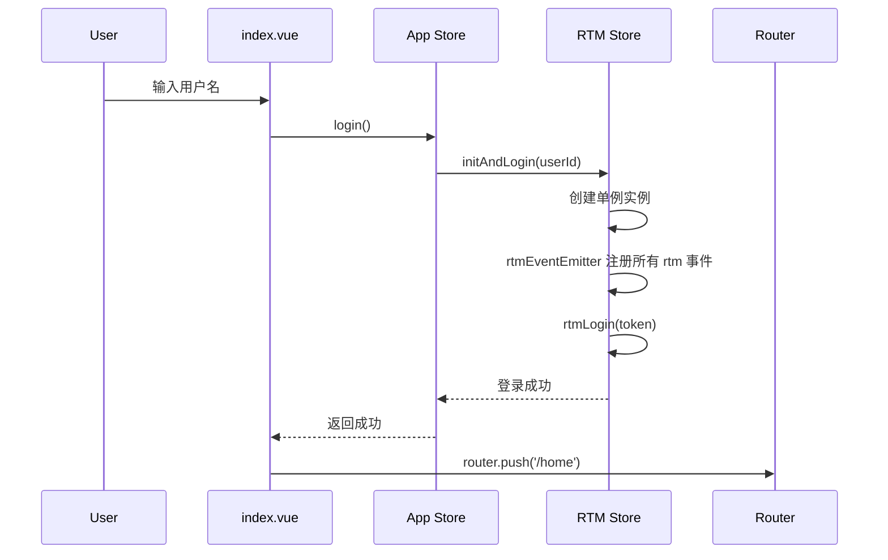
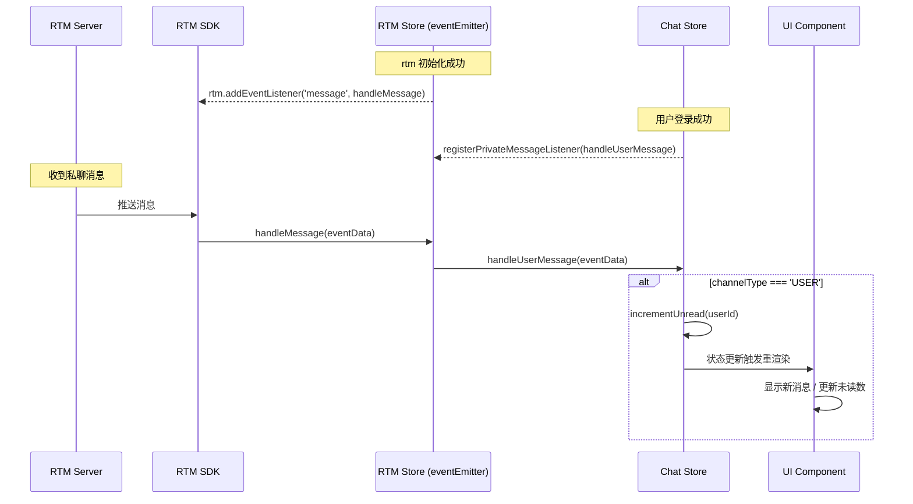
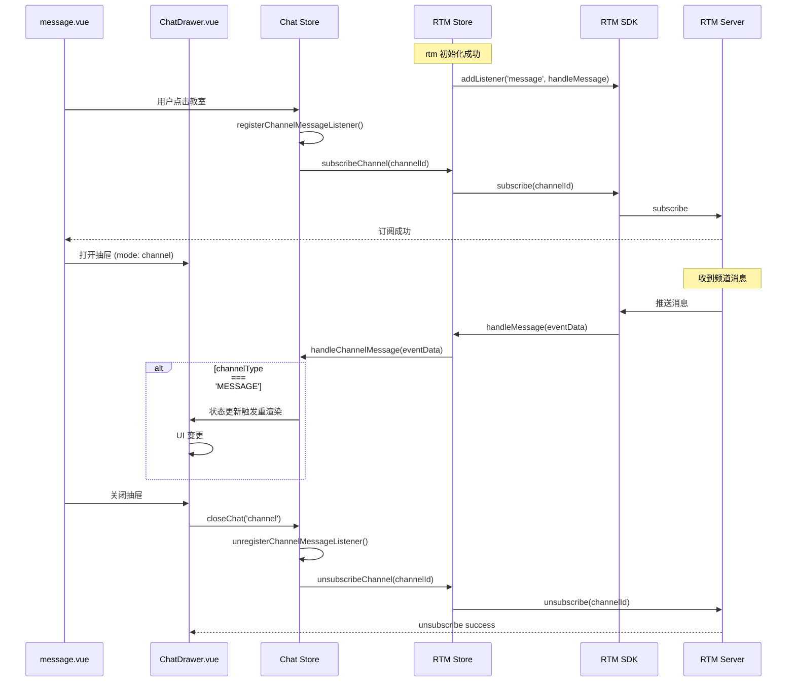
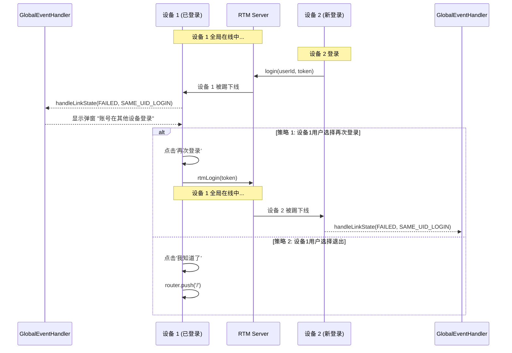

# Nuxt 3 项目 RTM 集成文档

本文档说明 Nuxt 3 项目集成 Agora RTM SDK 的架构设计和实现细节。

---

## 1. 概述

### 1.1 核心目标

- ✅ **单例管理**：全局唯一 RTM 实例，避免多个实例重复登录引发未知问题
- ✅ **事件集中处理**：统一事件监听和分发机制
- ✅ **连接状态同步**：跨组件的消息和连接状态管理
- ✅ **防止互踢**：正确处理 `SAME_UID_LOGIN` 事件

### 1.2 技术栈

- **框架**：Nuxt 3
- **状态管理**：Pinia
- **RTM SDK**：agora-rtm

---

## 2. 分层架构

### 2.1 架构图

```
┌─────────────────────────────────────────────────────────────────┐
│                    UI Layer (Pages & Components)                │
│  ┌──────────────┐  ┌──────────────┐  ┌──────────────┐           │
│  │  index.vue   │  │  home.vue    │  │ message.vue  │           │
│  │  (登录页)     │  │  (首页)       │  │ (消息页)      │           │
│  └──────────────┘  └──────────────┘  └──────┬───────┘           │
│                                             │                   │
│  ┌──────────────────────────────────────────┼──────────────┐    │
│  │  app.vue（全局布局）                       │              │    │
│  │  ┌────────────────┐  ┌───────────────────▼──────────┐   │    │
│  │  │ Navbar.vue     │  │ GlobalEventHandler.vue       │   │    │
│  │  │ （登出/导航）    │  │ （互踢 / Token 过期 /私聊监听）  │  │    │
│  │  └────────────────┘  └──────────────────────────────┘   │    │
│  └─────────────────────────────────────────────────────────┘    │
└─────────┼───────────────────────────────────────┼───────────────┘
          │                                       │
┌─────────┼───────────────────────────────────────┼────────────────┐
│         │    State Layer (Pinia Stores)         │                │
│  ┌──────▼───────┐  ┌──────────────┐  ┌──────────▼─────┐          │
│  │  App Store   │  │  User Store  │  │  Chat Store    │          │
│  │  (登录/登出)  │  │  (用户状态)   │   │  (消息/业务)    │          │
│  └──────┬───────┘  └──────────────┘  └─────────┬──────┘          │
│         │                                      │                 │
│  ┌──────▼──────────────────────────────────────▼──────┐          │
│  │              RTM Store（薄封装层）                   │          │
│  │  - 事件监听器注册/清理                                │          │
│  │  - RTM 操作封装（消息 / 订阅 / 登录 / 登出）           │           │
│  │  - 状态检查                                         │          │
│  └──────┬──────────────────────────────────────────────┘         │
└─────────┼────────────────────────────────────────────────────────┘
          │
┌─────────▼────────────────────────────────────────────────────────┐
│              RTM Layer (shared/rtm)                              │
│  ┌──────────────┐  ┌──────────────┐  ┌──────────────┐            │
│  │ RTM Client   │  │ Event Emitter│  │ Message API  │            │
│  │  (Singleton) │  │  (EventBus)  │  │ Channel API  │            │
│  └──────────────┘  └──────────────┘  └──────────────┘            │
└──────────────────────────────────────────────────────────────────┘
```

### 2.2 核心组件

| 组件                       | 职责                                       | 位置                                |
| -------------------------- | ------------------------------------------ | ----------------------------------- |
| **RTM Store**              | RTM 操作薄封装层（提供事件监听注册）       | `stores/rtm.ts`                     |
| **App Store**              | 应用级状态管理（登录/登出）                | `stores/app.ts`                     |
| **Chat Store**             | 消息状态管理 + 业务逻辑                    | `stores/chat.ts`                    |
| **User Store**             | 用户状态管理                               | `stores/user.ts`                    |
| **GlobalEventHandler.vue** | 全局事件处理（互踢/Token 过期/私聊监听）   | `components/GlobalEventHandler.vue` |
| **Navbar.vue**             | 全局导航栏（登出）                         | `components/Navbar.vue`             |

### 2.3 消息监听策略 ⭐

本架构采用**分层监听策略**，根据消息类型的特点采用不同的监听生命周期：

| 消息类型               | 监听时机       | 生命周期             | 注册位置                            | 处理函数               |
| -------------------- | -------------- | ----------------- | ----------------------------------- | ---------------------- |
| **私有消息 (USER)**    | 登录成功后     | 伴随 App 生命周期    | `components/GlobalEventHandler.vue` | `handleUserMessage`    |
| **频道消息 (MESSAGE)** | 打开频道聊天时 | 仅在聊天窗口打开期间 | `stores/chat.ts` (openChannelChat)  | `handleChannelMessage` |

#### 设计理由

**私有消息 - 全局监听**：

- ✅ 用户随时可能收到私聊消息
- ✅ 需要实时更新未读数和消息列表
- ✅ 即使用户不在聊天界面，也要接收并存储消息
- ✅ 在 GlobalEventHandler 中注册，伴随 app.vue 生命周期

**频道消息 - 按需监听**：

- ✅ 仅在用户主动进入频道时才需要接收
- ✅ 离开频道后取消监听，节省资源
- ✅ 避免接收用户未订阅频道的消息
- ✅ 在 Chat Store 的 openChannelChat 方法中注册，closeChat 时清理

#### 实现示例

```typescript
// 1. GlobalEventHandler - 注册私有消息监听（全局生命周期）
// components/GlobalEventHandler.vue
<script setup lang="ts">
import { onMounted, onUnmounted, watch } from "vue";
import { useRtmStore } from "../stores/rtm";
import { useChatStore } from "../stores/chat";

const rtmStore = useRtmStore();
const chatStore = useChatStore();

onMounted(() => {
  if (rtmStore.checkRtmStatus()) {
    // 登录后，全局监听私聊消息
    chatStore.registerPrivateMessageListener();
  }
});

onUnmounted(() => {
  chatStore.unregisterPrivateMessageListener();
});

// 监听 RTM 登录状态变化
watch(() => rtmStore.isLoggedIn, (isLoggedIn) => {
  if (isLoggedIn) {
    chatStore.registerPrivateMessageListener();
  }
});
</script>
```

```typescript
// 2. Chat Store - 打开频道聊天时注册频道消息监听
// stores/chat.ts
async openChannelChat(channelId: string): Promise<void> {
  const rtmStore = useRtmStore();

  // 订阅前先注册监听器
  this.registerChannelMessageListener();

  // 订阅频道
  await rtmStore.subscribeChannel(channelId);

  // 记录当前频道
  this.currentChannelId = channelId;
},

// 3. Chat Store - 关闭聊天时清理频道消息监听
async closeChat(mode: "private" | "channel"): Promise<void> {
  if (mode === "channel" && this.currentChannelId) {
    const rtmStore = useRtmStore();

    // 先取消监听器
    this.unregisterChannelMessageListener();

    // 取消订阅频道
    await rtmStore.unsubscribeChannel(this.currentChannelId);

    // 清空当前频道
    this.currentChannelId = null;
  }
},
```

---

## 3. 流程图

### 3.1 登录流程



### 3.2 私有消息接收流程



### 3.3 频道消息接收流程



### 3.4 多端互踢处理流程



---

## 4. Nuxt 3 特殊配置

### 4.1 禁用 SSR

Agora RTM SDK 仅在客户端可用，需要在 `nuxt.config.ts` 中禁用 SSR：

```typescript
// nuxt.config.ts
export default defineNuxtConfig({
  ssr: false, // 禁用 SSR，纯前端应用
});
```

### 4.2 Vite 配置

配置 Vite 预构建 events 模块：

```typescript
// nuxt.config.ts
export default defineNuxtConfig({
  vite: {
    optimizeDeps: {
      include: ["events"],
    },
  },
});
```

### 4.3 Pinia 模块

Nuxt 使用 Pinia 进行状态管理：

```typescript
// nuxt.config.ts
export default defineNuxtConfig({
  modules: ["@pinia/nuxt"],
});
```

### 4.4 环境变量配置

由于禁用了 SSR，直接使用 Vite 的 `VITE_*` 环境变量：

```bash
# .env
VITE_APP_ID=your_app_id
VITE_APP_CERT=your_app_cert
```

### 4.5 完整配置示例

```typescript
// nuxt.config.ts
export default defineNuxtConfig({
  devtools: { enabled: false },

  ssr: false, // 禁用 SSR，纯前端应用

  modules: ["@pinia/nuxt"],

  vite: {
    optimizeDeps: {
      include: ["events"],
    },
  },
});
```

---

## 5. 关键设计决策

### 5.1 RTM Store - 薄封装层

**位置**：`stores/rtm.ts`

```typescript
// stores/rtm.ts
import { defineStore } from "pinia";
import {
  initRtm,
  releaseRtm,
  subscribeChannel as rtmSubscribeChannel,
  unsubscribeChannel as rtmUnsubscribeChannel,
  sendMessageToUser as rtmSendMessageToUser,
  sendChannelMessage as rtmSendChannelMessage,
  rtmEventEmitter,
  rtmLogin as rtmSdkLogin,
  getGlobalRtmClient,
} from "../../shared/rtm";
import type { RTMEvents } from "../../shared/rtm";

export const useRtmStore = defineStore("rtm", {
  state: () => ({
    isInitialized: false,
    isLoggedIn: false,
  }),

  actions: {
    // RTM 初始化和登录
    async initAndLogin(userId: string): Promise<void> {
      const token = await this.generateRTMToken();
      await initRtm(userId, token);
      this.isInitialized = true;
      this.isLoggedIn = true;
    },

    // 检查 RTM 状态
    checkRtmStatus(): boolean {
      try {
        getGlobalRtmClient();
        return true;
      } catch {
        return false;
      }
    },

    // 事件监听器注册
    registerMessageListener(handler: (eventData: RTMEvents.MessageEvent) => void): void {
      rtmEventEmitter.addListener("message", handler);
    },

    unregisterMessageListener(handler: (eventData: RTMEvents.MessageEvent) => void): void {
      rtmEventEmitter.removeListener("message", handler);
    },

    registerLinkStateListener(handler: (eventData: RTMEvents.LinkStateEvent) => void): void {
      rtmEventEmitter.addListener("linkState", handler);
    },

    unregisterLinkStateListener(handler: (eventData: RTMEvents.LinkStateEvent) => void): void {
      rtmEventEmitter.removeListener("linkState", handler);
    },

    // 其他 RTM 操作封装...
  },
});
```

**设计原则**：

- ✅ **薄封装**：不重新实现逻辑，只是包装 `shared/rtm` 的方法
- ✅ **状态管理**：维护 RTM 连接状态（isInitialized, isLoggedIn）
- ✅ **事件管理**：提供统一的事件监听器注册/清理接口
- ✅ **类型安全**：提供 TypeScript 类型定义

### 5.2 App Store - 应用级状态管理

**位置**：`stores/app.ts`

```typescript
// stores/app.ts
import { defineStore } from "pinia";
import { useRtmStore } from "./rtm";
import { useUserStore } from "./user";

export const useAppStore = defineStore("app", {
  state: () => ({
    isLoading: false,
  }),

  actions: {
    async login(): Promise<void> {
      this.isLoading = true;

      try {
        const rtmStore = useRtmStore();
        const userStore = useUserStore();

        // RTM 初始化和登录
        await rtmStore.initAndLogin(userStore.userId);

        // 保存登录状态
        localStorage.setItem("username", userStore.userId);
        localStorage.setItem("token", "mock-token-" + Date.now());
      } finally {
        this.isLoading = false;
      }
    },

    async logout(): Promise<void> {
      const rtmStore = useRtmStore();
      await rtmStore.logout();
      localStorage.removeItem("token");
      localStorage.removeItem("username");
    },
  },
});
```

**好处**：

- ✅ **集中管理**：登录/登出逻辑集中在一个地方
- ✅ **UI 简化**：UI 层只需调用 `login()` 和 `logout()`
- ✅ **易于维护**：修改登录流程只需改一个地方

### 5.3 GlobalEventHandler 作为全局事件中心

**位置**：`components/GlobalEventHandler.vue`

```vue
<!-- components/GlobalEventHandler.vue -->
<template>
  <ClientOnly>
    <div v-if="showKickDialog" class="kick-dialog-overlay">
      <div class="kick-dialog">
        <h2>⚠️ 账号在其他设备登录</h2>
        <p>检测到您的账号在其他设备登录，当前连接已断开。</p>
        <div class="kick-dialog-buttons">
          <button @click="handleDismiss" class="btn-secondary">我知道了</button>
          <button @click="handleRelogin" class="btn-primary">再次登录</button>
        </div>
      </div>
    </div>
  </ClientOnly>
</template>

<script setup lang="ts">
import { ref, onMounted, onUnmounted, watch } from "vue";
import { useRtmStore } from "../stores/rtm";
import { useChatStore } from "../stores/chat";
import type { RTMEvents } from "agora-rtm";

const router = useRouter();
const route = useRoute();
const showKickDialog = ref(false);
const isListenerRegistered = ref(false);

const rtmStore = useRtmStore();
const chatStore = useChatStore();

// ⭐ 处理 linkState 事件（互踢、Token过期）
const handleLinkState = async (eventData: RTMEvents.LinkStateEvent) => {
  const { currentState, reasonCode } = eventData;

  // 处理互踢
  if (currentState === "FAILED" && reasonCode === "SAME_UID_LOGIN") {
    showKickDialog.value = true;
  }

  // 处理 Token 过期
  if (currentState === "FAILED" && (reasonCode === "INVALID_TOKEN" || reasonCode === "TOKEN_EXPIRED")) {
    try {
      await rtmStore.rtmLogin();
    } catch (error) {
      console.error("Token refresh failed:", error);
    }
  }
};

// 注册监听器
const registerListeners = () => {
  if (isListenerRegistered.value) return;
  if (!rtmStore.checkRtmStatus()) return;

  // 1. 注册私有消息监听（全局生命周期）
  chatStore.registerPrivateMessageListener();

  // 2. 注册 linkState 监听（处理互踢/Token过期）
  rtmStore.registerLinkStateListener(handleLinkState);

  isListenerRegistered.value = true;
};

// 监听 RTM 登录状态
watch(() => rtmStore.isLoggedIn, (isLoggedIn) => {
  if (isLoggedIn) {
    registerListeners();
  }
});

onMounted(() => {
  if (route.path !== "/") {
    registerListeners();
  }
});

onUnmounted(() => {
  if (isListenerRegistered.value) {
    chatStore.unregisterPrivateMessageListener();
    rtmStore.unregisterLinkStateListener(handleLinkState);
  }
});

const handleRelogin = async () => {
  try {
    await rtmStore.rtmLogin();
    showKickDialog.value = false;
  } catch (error) {
    console.error("重新登录失败:", error);
  }
};

const handleDismiss = () => {
  showKickDialog.value = false;
  router.push("/");
};
</script>
```

**架构**：

- ✅ **全局组件**：在 app.vue 中引入，伴随应用生命周期
- ✅ **集中处理**：所有全局事件（互踢、Token 过期、私聊监听）在一个组件中管理
- ✅ **自动清理**：组件卸载时自动清理所有监听器

### 5.4 Chat Store 管理业务逻辑

**位置**：`stores/chat.ts`

```typescript
// stores/chat.ts
import { defineStore } from "pinia";
import type { Message } from "../types/chat";
import { useUserStore } from "./user";
import { useRtmStore } from "./rtm";

export const useChatStore = defineStore("chat", {
  state: () => ({
    privateMessages: {} as Record<string, Message[]>,
    channelMessages: {} as Record<string, Message[]>,
    unreadCounts: {} as Record<string, number>,
    currentChannelId: null as string | null,
  }),

  actions: {
    // 业务方法：发送消息
    async sendMessage(targetId: string, content: string, mode: "private" | "channel"): Promise<void> {
      const rtmStore = useRtmStore();
      const userStore = useUserStore();

      if (mode === "private") {
        // 调用 RTM Store 发送
        await rtmStore.sendPrivateMessage(targetId, content);

        // 更新本地状态
        const msg: Message = {
          id: `${Date.now()}-${Math.random()}`,
          senderId: userStore.userId,
          senderName: "Me",
          content,
          timestamp: Date.now(),
        };
        this.addPrivateMessage(targetId, msg);
      } else {
        await rtmStore.sendChannelMessage(targetId, content);
        // 频道消息通过监听器自动添加
      }
    },

    // 业务方法：打开频道聊天
    async openChannelChat(channelId: string): Promise<void> {
      const rtmStore = useRtmStore();

      // 1. 注册监听器
      this.registerChannelMessageListener();

      // 2. 订阅频道
      await rtmStore.subscribeChannel(channelId);

      // 3. 记录状态
      this.currentChannelId = channelId;
    },

    // 业务方法：关闭聊天
    async closeChat(mode: "private" | "channel"): Promise<void> {
      if (mode === "channel" && this.currentChannelId) {
        const rtmStore = useRtmStore();

        // 先取消监听器
        this.unregisterChannelMessageListener();

        // 取消订阅频道
        await rtmStore.unsubscribeChannel(this.currentChannelId);

        this.currentChannelId = null;
      }
    },

    // 消息监听器注册
    registerPrivateMessageListener() {
      const rtmStore = useRtmStore();
      rtmStore.registerMessageListener(handleUserMessage);
    },

    unregisterPrivateMessageListener() {
      const rtmStore = useRtmStore();
      rtmStore.unregisterMessageListener(handleUserMessage);
    },

    registerChannelMessageListener() {
      const rtmStore = useRtmStore();
      rtmStore.registerMessageListener(handleChannelMessage);
    },

    unregisterChannelMessageListener() {
      const rtmStore = useRtmStore();
      rtmStore.unregisterMessageListener(handleChannelMessage);
    },
  },
});

// 消息处理器（供 RTM Store 回调）
export const handleUserMessage = (eventData: any) => {
  const chatStore = useChatStore();
  const { publisher, message, channelType } = eventData;

  if (channelType === "USER") {
    const msg: Message = {
      id: `${Date.now()}-${Math.random()}`,
      senderId: publisher,
      senderName: publisher,
      content: message,
      timestamp: Date.now(),
    };
    chatStore.addPrivateMessage(publisher, msg);
    chatStore.incrementUnread(publisher);
  }
};

export const handleChannelMessage = (eventData: any) => {
  const chatStore = useChatStore();
  const userStore = useUserStore();
  const { publisher, message, channelType, channelName } = eventData;

  if (channelType === "MESSAGE") {
    const senderName = publisher === userStore.userId ? "Me" : publisher;
    const msg: Message = {
      id: `${Date.now()}-${Math.random()}`,
      senderId: publisher,
      senderName,
      content: message,
      timestamp: Date.now(),
    };
    chatStore.addChannelMessage(channelName, msg);
  }
};
```

**好处**：

- ✅ **业务封装**：UI 层不需要知道 RTM 的存在
- ✅ **状态管理**：统一管理消息状态（privateMessages, channelMessages）
- ✅ **逻辑复用**：业务方法可以在多个组件中复用

---

## 6. 防止多端互踢的最佳实践

### 6.1 问题根源

**互踢原因**：

- 每个声网签发的 AppId 下，同一 `userId` 在多个设备/浏览器标签页登录
  - App 初始化页面被执行多次，每次用同一个 userId 创建新的 RTM 实例并登录
  - App 各组件都调用了 rtm login，可能存在同实例在本地多次同时执行 login
- RTM Server 默认只保留最新登录的连接

### 6.2 解决方案

#### 方案 1：单例模式（推荐）

```typescript
// ✅ 正确：全局单例
let globalRtmClient: RTM | null = null;

export function initRtm(appId: string, userId: string): RTM {
  if (globalRtmClient) {
    console.log("RTM client already exists, reusing...");
    return globalRtmClient;
  }
  globalRtmClient = new RTM(appId, userId);
  return globalRtmClient;
}

// ❌ 错误：每次都创建新实例
export function initRtm(appId: string, userId: string): RTM {
  return new RTM(appId, userId); // 可能导致互踢！
}
```

#### 方案 2：检测并处理 SAME_UID_LOGIN

```vue
<script setup lang="ts">
import type { RTMEvents } from "agora-rtm";

const router = useRouter();
const rtmStore = useRtmStore();

const handleLinkState = async (eventData: RTMEvents.LinkStateEvent) => {
  if (eventData.currentState === "FAILED") {
    if (eventData.reasonCode === "SAME_UID_LOGIN") {
      // 显示对话框让用户选择
      showKickDialog.value = true;
    }
  }
};

const handleRelogin = async () => {
  // 策略 A：保留当前设备，重新登录
  await rtmStore.rtmLogin();
  showKickDialog.value = false;
};

const handleDismiss = () => {
  // 策略 B：保留新设备，退出当前设备
  showKickDialog.value = false;
  router.push("/");
};
</script>
```

---

## 7. 目录结构

```
demos/nuxt/
├── app.vue                         # 根布局（集成 GlobalEventHandler 和 Navbar）
├── pages/
│   ├── index.vue                   # 登录页（初始化并登录 RTM）
│   ├── home.vue                    # Home 页面
│   ├── message.vue                 # Message 页面（聊天功能）⭐
│   └── more.vue                    # More 页面
│
├── components/
│   ├── GlobalEventHandler.vue      # 全局事件处理（互踢/Token过期/私聊监听）⭐
│   ├── Navbar.vue                  # 全局导航栏
│   ├── ChatDrawer.vue              # 聊天抽屉组件
│   ├── ClassroomList.vue           # 教室列表组件
│   ├── TeacherList.vue             # 教师列表组件
│   └── StudentList.vue             # 学生列表组件
│
├── stores/
│   ├── app.ts                      # 应用状态（登录/登出）⭐
│   ├── rtm.ts                      # RTM 操作薄封装层 ⭐
│   ├── chat.ts                     # 消息状态 + 消息处理器 ⭐
│   └── user.ts                     # 用户状态
│
├── docs/
│   └── NUXT_RTM_INTEGRATION.md     # 本文档
│
├── nuxt.config.ts                  # Nuxt 配置
├── tsconfig.json                   # TypeScript 配置
├── package.json                    # 项目依赖
└── .env.example                    # 环境变量示例
```

**关键文件**：

- ⭐ `components/GlobalEventHandler.vue`：全局互踢事件处理组件
- ⭐ `pages/message.vue`：消息页面，业务层订阅事件
- ⭐ `stores/rtm.ts`：RTM 操作薄封装层，提供事件监听注册
- ⭐ `stores/app.ts`：应用级状态管理（登录/登出）
- ⭐ `stores/chat.ts`：消息状态管理 + 消息处理函数

---

## 8. 使用示例

### 8.1 登录页 - 初始化 RTM

```vue
<!-- pages/index.vue -->
<template>
  <div class="login-container">
    <div class="login-card">
      <h1>RTM SDK Demo</h1>
      <form @submit.prevent="handleLogin">
        <div class="form-group">
          <label for="username">User ID</label>
          <input
            id="username"
            type="text"
            placeholder="Enter your user ID"
            v-model="userStore.userId"
            :disabled="loading"
          />
        </div>
        <div v-if="error" class="error-message">{{ error }}</div>
        <button type="submit" :disabled="loading">
          {{ loading ? "Logging in..." : "Login to App" }}
        </button>
      </form>
    </div>
  </div>
</template>

<script setup lang="ts">
import { ref } from "vue";
import { useUserStore } from "../stores/user";
import { useAppStore } from "../stores/app";

const userStore = useUserStore();
const appStore = useAppStore();
const loading = ref(false);
const error = ref("");
const router = useRouter();

const handleLogin = async () => {
  if (!userStore.userId.trim()) {
    error.value = "Please enter a username";
    return;
  }

  try {
    loading.value = true;
    error.value = "";

    // 调用 App Store 的 login 方法
    await appStore.login();

    // 登录后跳转
    await router.push("/home");
  } catch (err) {
    error.value = "Login failed. Please try again.";
    console.error(err);
  } finally {
    loading.value = false;
  }
};
</script>
```

### 8.2 app.vue - 集成全局组件

```vue
<!-- app.vue -->
<template>
  <div>
    <!-- ⭐ 全局事件处理（私聊监听、互踢、Token过期） -->
    <GlobalEventHandler />
    <!-- ⭐ 全局导航栏（登录后显示） -->
    <Navbar v-if="showNavbar" />
    <main :style="showNavbar ? { marginLeft: '200px' } : {}">
      <NuxtPage />
    </main>
  </div>
</template>

<script setup lang="ts">
import { computed } from "vue";

const route = useRoute();

// 登录页面不显示导航栏
const showNavbar = computed(() => route.path !== "/");
</script>
```

### 8.3 Message 页 - 使用 Chat Store

```vue
<!-- pages/message.vue -->
<template>
  <div class="message-container">
    <div class="message-content">
      <ClassroomList :classrooms="MOCK_CLASSROOMS" @classroom-click="handleClassroomClick" />
      <TeacherList :teachers="MOCK_TEACHERS" @teacher-click="handlePrivateChatClick" />
    </div>

    <ChatDrawer
      :state="drawerState"
      :current-user-id="userStore.userId"
      @close="handleCloseDrawer"
      @send-message="handleSendMessage"
    />
  </div>
</template>

<script setup lang="ts">
import { ref, onMounted } from "vue";
import { useChatStore } from "../stores/chat";
import { useUserStore } from "../stores/user";
import { useRtmStore, MOCK_CLASSROOMS, MOCK_TEACHERS } from "../stores/rtm";
import type { Classroom, User, ChatDrawerState } from "../stores/rtm";

const router = useRouter();
const userStore = useUserStore();
const chatStore = useChatStore();
const rtmStore = useRtmStore();

const drawerState = ref<ChatDrawerState>({
  isOpen: false,
  mode: "private",
  targetId: "",
  targetName: "",
});

onMounted(() => {
  // 检查 RTM 状态
  if (!rtmStore.checkRtmStatus()) {
    router.push("/");
  }
});

const handlePrivateChatClick = (user: User) => {
  // 打开私聊（清零未读数）
  chatStore.openPrivateChat(user.userId);

  drawerState.value = {
    isOpen: true,
    mode: "private",
    targetId: user.userId,
    targetName: user.name,
  };
};

const handleClassroomClick = async (classroom: Classroom) => {
  try {
    // 打开频道聊天（订阅 + 注册监听器）
    await chatStore.openChannelChat(classroom.id);

    drawerState.value = {
      isOpen: true,
      mode: "channel",
      targetId: classroom.id,
      targetName: classroom.name,
    };
  } catch (error) {
    console.error("Failed to open channel chat:", error);
  }
};

const handleCloseDrawer = async () => {
  try {
    // 关闭聊天（取消订阅 + 清理监听器）
    await chatStore.closeChat(drawerState.value.mode);

    drawerState.value = { ...drawerState.value, isOpen: false };
  } catch (error) {
    console.error("Failed to close chat:", error);
  }
};

const handleSendMessage = async (content: string) => {
  try {
    // 发送消息（通过 Chat Store）
    await chatStore.sendMessage(drawerState.value.targetId, content, drawerState.value.mode);
  } catch (error) {
    console.error("Failed to send message:", error);
  }
};
</script>
```

**注意**：

- ✅ UI 层不直接调用 RTM API
- ✅ 所有操作通过 Chat Store 完成
- ✅ Chat Store 内部调用 RTM Store

### 8.4 ChatDrawer - 纯展示组件

```vue
<!-- components/ChatDrawer.vue -->
<template>
  <div v-if="state.isOpen" class="chat-drawer-overlay" @click="emit('close')">
    <div class="chat-drawer" @click.stop>
      <div class="chat-drawer-header">
        <h3>{{ state.targetName }}</h3>
        <button @click="emit('close')" class="close-button">×</button>
      </div>

      <div class="chat-drawer-messages">
        <div
          v-for="msg in messages"
          :key="msg.id"
          :class="['message', msg.senderId === currentUserId ? 'sent' : 'received']"
        >
          <div class="message-sender">{{ msg.senderName }}</div>
          <div class="message-content">{{ msg.content }}</div>
        </div>
        <div ref="messagesEndRef" />
      </div>

      <div class="chat-drawer-input">
        <input
          v-model="inputValue"
          placeholder="Type a message..."
          @keyup.enter="handleSend"
        />
        <button @click="handleSend">Send</button>
      </div>
    </div>
  </div>
</template>

<script setup lang="ts">
import { ref, computed, watch, nextTick } from "vue";
import type { ChatDrawerState } from "../types/chat";
import { useChatStore } from "../stores/chat";

interface Props {
  state: ChatDrawerState;
  currentUserId: string;
}

const props = defineProps<Props>();
const emit = defineEmits<{
  close: [];
  sendMessage: [content: string];
}>();

const chatStore = useChatStore();
const inputValue = ref("");
const messagesEndRef = ref<HTMLDivElement | null>(null);

const messages = computed(() => {
  if (props.state.mode === "private") {
    return chatStore.privateMessages[props.state.targetId] || [];
  } else {
    return chatStore.channelMessages[props.state.targetId] || [];
  }
});

// 自动滚动到底部
watch(messages, async () => {
  await nextTick();
  messagesEndRef.value?.scrollIntoView({ behavior: "smooth" });
}, { deep: true });

const handleSend = () => {
  if (!inputValue.value.trim()) return;
  emit("sendMessage", inputValue.value.trim());
  inputValue.value = "";
};
</script>
```

**注意**：

- ✅ 纯展示组件，不包含任何 RTM 逻辑
- ✅ 通过 props 接收状态，通过 emit 触发事件
- ✅ 从 Chat Store 读取消息状态

### 8.5 Navbar - 登出处理

```vue
<!-- components/Navbar.vue -->
<template>
  <nav class="navbar">
    <ul class="navbar-menu">
      <li v-for="item in navItems" :key="item.path">
        <a
          @click.prevent="navigateTo(item.path)"
          :class="{ active: route.path === item.path }"
        >
          <span class="navbar-icon">{{ item.icon }}</span>
          <span class="navbar-label">{{ item.label }}</span>
        </a>
      </li>
    </ul>

    <div class="navbar-footer">
      <button @click="handleLogout" class="logout-button">
        <span class="navbar-icon">🚪</span>
        <span class="navbar-label">Logout</span>
      </button>
    </div>
  </nav>
</template>

<script setup lang="ts">
import { useAppStore } from "../stores/app";

const route = useRoute();
const router = useRouter();
const appStore = useAppStore();

const navItems = [
  { path: "/home", label: "Home", icon: "🏠" },
  { path: "/message", label: "Message", icon: "💬" },
  { path: "/more", label: "More", icon: "⋯" },
];

const navigateTo = async (path: string) => {
  await router.push(path);
};

const handleLogout = async () => {
  try {
    // 调用 App Store 的 logout 方法
    await appStore.logout();
    await router.push("/");
  } catch (error) {
    console.error("Logout failed:", error);
    await router.push("/");
  }
};
</script>
```

**注意**：

- ✅ UI 层只调用 App Store 的 logout 方法
- ✅ App Store 内部处理所有清理逻辑（取消监听、登出 RTM、清理存储）

---

## 9. 常见问题

### Q1: 为什么要禁用 SSR？

Agora RTM SDK 依赖浏览器 API（如 WebSocket），无法在服务端运行。Nuxt 3 默认启用 SSR，必须禁用以避免服务端渲染时报错。

### Q2: 为什么私有消息和频道消息要分开监听？

基于不同的业务需求和生命周期：

- **私有消息**：用户随时可能收到，需要全局监听以实时更新未读数
- **频道消息**：仅在用户主动进入频道时才需要，按需监听节省资源

这种设计符合用户预期，也更高效。

### Q3: 为什么要使用 EventEmitter？

解耦 SDK 和业务逻辑。

- RTM SDK 的事件监听器是全局的，直接在组件中注册会导致重复注册
- EventEmitter 作为中间层，允许多个组件订阅同一事件
- 组件卸载时可以安全地取消订阅，不影响其他组件

### Q4: 如何避免多端互踢？

三个关键点：

1. 使用单例模式，全局只创建一个 RTM 实例
2. **监听 `linkState` 事件，检测 `SAME_UID_LOGIN`**
3. 页面切换时复用实例，不要重复登录（使用 rtmStore 即可保证）

### Q5: 与 Next.js 项目的主要区别？

| 特性           | Nuxt 3                      | Next.js                    |
| -------------- | --------------------------- | -------------------------- |
| **状态管理**   | Pinia (`defineStore`)       | Zustand (`create`)         |
| **SSR 处理**   | `ssr: false` 全局禁用       | `'use client'` 按组件标记  |
| **环境变量**   | `VITE_*` 前缀               | `NEXT_PUBLIC_*` 前缀       |
| **路由目录**   | `pages/`                    | `app/`                     |
| **组件语法**   | Vue SFC (`<script setup>`)  | React JSX                  |
| **生命周期**   | `onMounted` / `onUnmounted` | `useEffect`                |
| **响应式状态** | `ref()` / `reactive()`      | `useState`                 |

---

## 10. 总结

### 10.1 架构优势

| 优势             | 说明                                                                 |
| ---------------- | -------------------------------------------------------------------- |
| **单例管理**     | 全局唯一 RTM 实例，避免重复登录和互踢                                |
| **分层监听**     | 私有消息全局监听，频道消息按需监听                                   |
| **事件解耦**     | EventEmitter 解耦 SDK 和业务，灵活订阅                               |
| **集中处理**     | 所有 RTM SDK 事件在 `rtm-events.ts` 中统一注册，由 EventEmitter 派发 |
| **状态同步**     | Pinia 跨组件共享消息状态                                             |
| **生命周期清晰** | 组件级别的事件订阅，自动清理                                         |
| **资源优化**     | 按需监听频道消息，节省资源                                           |
| **易于测试**     | 业务逻辑和 SDK 分离，便于 Mock 测试                                  |

### 10.2 最佳实践清单

**RTM 实例管理**：

- ✅ 使用单例模式管理 RTM 实例
- ✅ 在 `shared/rtm/rtm-events.ts` 中注册全局事件监听器
- ✅ 页面切换时复用实例，不要重复登录
- ✅ **使用 GlobalEventHandler 组件全局监听 `linkState` 事件处理互踢**
- ✅ 在 app.vue 中引入 GlobalEventHandler，所有页面自动生效
- ✅ 收到掉线通知时，提供用户选择："我知道了，回到首页" 或 "再次登录"

**消息监听策略**：

- ✅ 私有消息在登录成功后立即注册全局监听
- ✅ 频道消息订阅频道时按需监听
- ✅ 组件卸载时取消事件订阅，防止内存泄漏
- ✅ 使用不同的处理函数区分消息类型

### 10.3 架构图总结

```
登录流程：
Login Page → rtm 封装层: initRtm() / 注册全局监听 → 业务层: 注册私有消息监听 / 注册互踢掉线监听 → Home Page

全局互踢处理：
GlobalEventHandler (app.vue) → 监听 linkState → 检测 SAME_UID_LOGIN → 显示对话框

私有消息流程：
RTM Server → SDK → SDK Events → EventEmitter → handleUserMessage → Chat Store → UI

频道消息流程：
打开频道 → 注册频道消息监听 → subscribeChannel() →
RTM Server → SDK → SDK Events → EventEmitter → handleChannelMessage → Chat Store → UI →
关闭频道 → 取消监听 → unsubscribeChannel()
```

---

**文档版本**：v1.1  
**最后更新**：2026-02-24  
**维护者**：AI Agent
