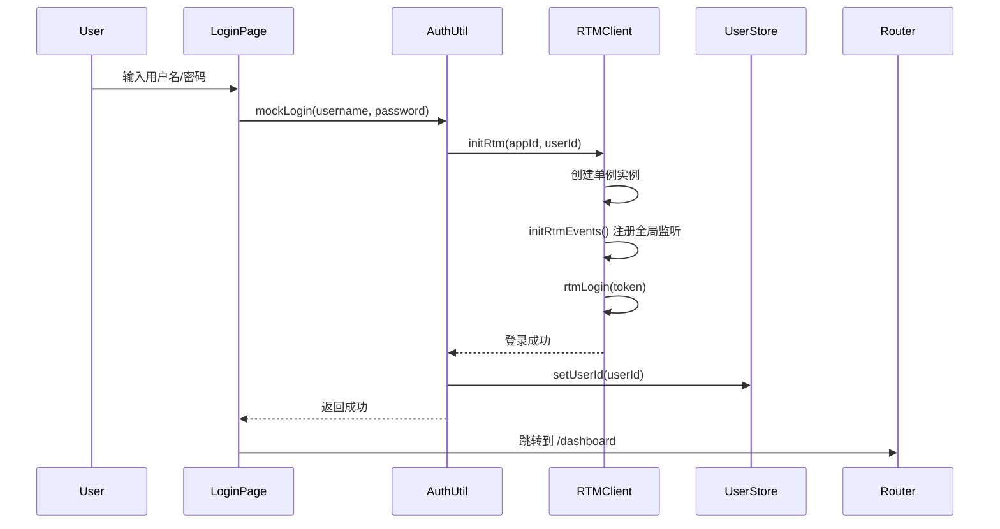
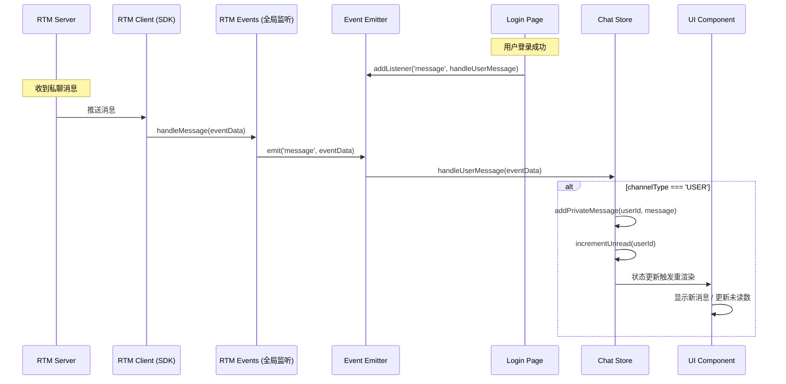
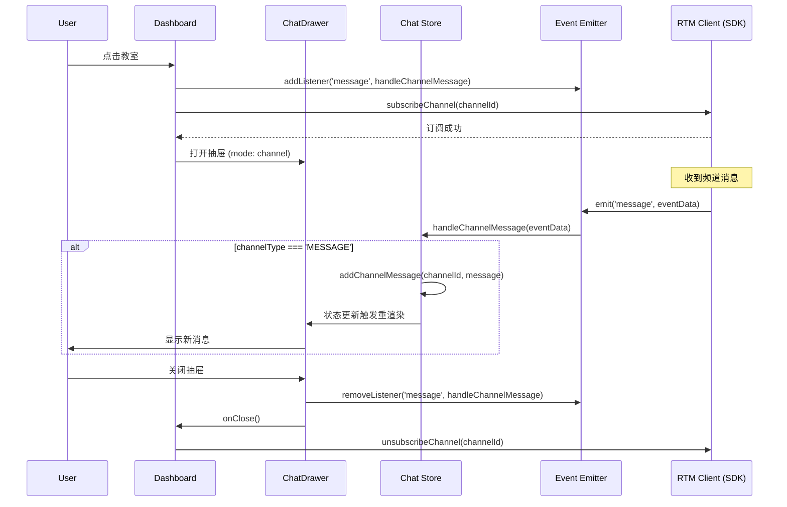
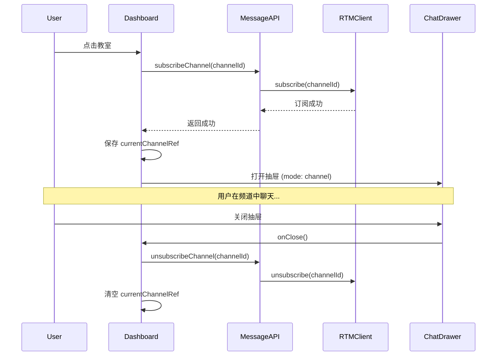
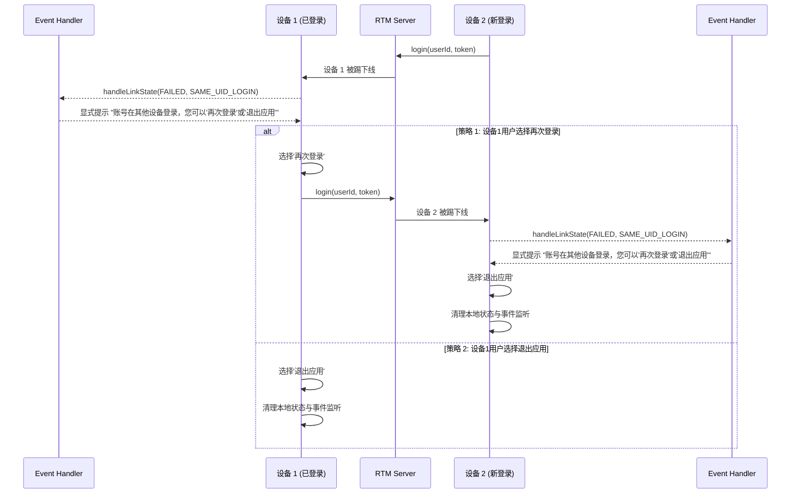

# WebRTM 接入架构设计文档

## 1. 概述

本文档描述 Next.js 项目中 Agora RTM SDK 的集成架构，提供最佳实践以避免多端互踢问题。

### 1.1 核心目标

- ✅ **单例管理**：全局唯一 RTM 实例，避免重复登录
- ✅ **事件集中处理**：统一事件监听和分发机制
- ✅ **状态同步**：跨组件的消息和连接状态管理
- ✅ **防止互踢**：正确处理 `SAME_UID_LOGIN` 事件

---

## 2. 架构设计

### 2.1 分层架构

```
┌─────────────────────────────────────────────────────────┐
│                    UI Layer (Pages)                     │
│  ┌──────────────┐  ┌──────────────┐  ┌──────────────┐   │
│  │  Login Page  │  │  Dashboard   │  │ ChatDrawer   │   │
│  └──────┬───────┘  └──────┬───────┘  └───────┬──────┘   │
│         │                 │                  │          │
└─────────┼─────────────────┼──────────────────┼──────────┘
          │                 │                  │
┌─────────┼─────────────────┼──────────────────┼───────────┐
│         │    State Layer (Zustand Stores)    │           │
│  ┌──────▼───────┐  ┌──────▼───────┐  ┌───────▼──────┐    │
│  │  User Store  │  │  Chat Store  │  │ Other Stores │    │
│  └──────┬───────┘  └──────┬───────┘  └──────┬───────┘    │
│         │                 │                 │            │
└─────────┼─────────────────┼─────────────────┼────────────┘
          │                 │                 │
┌─────────┼─────────────────┼─────────────────┼────────────┐
│         │    RTM Layer (shared/rtm)         │            │
│  ┌──────▼───────┐  ┌──────▼───────┐  ┌──────▼───────┐    │
│  │ RTM Client   │  │ Event Emitter│  │ Message API  │    │
│  │  (Singleton) │  │  (EventBus)  │  │ Channel API  │    │
│  └──────────────┘  └──────────────┘  └──────────────┘    │
└──────────────────────────────────────────────────────────┘
```

### 2.2 核心组件

| 组件              | 职责                      | 位置                       |
| ----------------- | ------------------------- | -------------------------- |
| **RTM Client**    | 单例 RTM 实例管理         | `shared/rtm/util.ts`       |
| **RTM Events**    | 全局事件监听器（SDK 层）  | `shared/rtm/rtm-events.ts` |
| **Event Emitter** | 事件总线，解耦 SDK 和业务 | `shared/rtm/util.ts`       |
| **Message API**   | 消息发送/订阅封装         | `shared/rtm/message.ts`    |
| **Chat Store**    | 消息状态管理 + 消息处理器 | `nextjs/store/chat.ts`     |
| **User Store**    | 用户状态管理              | `nextjs/store/user.ts`     |

### 2.3 消息监听策略 ⭐

本架构采用**分层监听策略**，根据消息类型的特点采用不同的监听生命周期：

| 消息类型               | 监听时机       | 生命周期             | 注册位置                        | 处理函数               |
| ---------------------- | -------------- | -------------------- | ------------------------------- | ---------------------- |
| **私有消息 (USER)**    | 登录成功后     | 伴随 App 生命周期    | `app/page.tsx` (登录页)         | `handleUserMessage`    |
| **频道消息 (MESSAGE)** | 打开频道聊天时 | 仅在聊天窗口打开期间 | `app/components/ChatDrawer.tsx` | `handleChannelMessage` |

#### 设计理由

**私有消息 - 全局监听**：

- ✅ 用户随时可能收到私聊消息
- ✅ 需要实时更新未读数和消息列表
- ✅ 即使用户不在聊天界面，也要接收并存储消息
- ✅ 在登录成功后立即注册，直到用户登出

**频道消息 - 按需监听**：

- ✅ 仅在用户主动进入频道时才需要接收
- ✅ 离开频道后取消监听，节省资源
- ✅ 避免接收用户未订阅频道的消息
- ✅ 在订阅频道前监听，防止漏掉消息，在 ChatDrawer 组件卸载时清理

#### 实现示例

```typescript
// 1. 登录页 - 注册私有消息监听
// app/page.tsx
const handleLogin = async () => {
  await mockLogin(userId, password);

  // 登录成功后，立即监听私有消息
  rtmEventEmitter.addListener("message", handleUserMessage);

  router.push("/dashboard");
};

// 2. 加入频道前 - 注册频道消息监听
// app/dashboard/page.tsx
const handleClassroomClick = async (classroom: Classroom) => {
  // 订阅前监听，确保不漏消息
  rtmEventEmitter.addListener("message", handleChannelMessage);

  await subscribeChannel(classroom.id);
};
// app/components/ChatDrawer.tsx
useEffect(() => {
  return () => {
    // 关闭时清理
    rtmEventEmitter.removeListener("message", handleChannelMessage);
  };
}, [state.isOpen, state.mode]);
```

---

## 3. 流程图

### 3.1 登录流程



### 3.2 私有消息接收流程



### 3.3 频道消息接收流程



### 3.4 频道订阅流程



### 3.5 多端互踢处理流程



---

## 4. 关键设计决策

### 4.1 RTM 实例绑定在 App 层

**位置**：`shared/rtm/util.ts`

```typescript
let globalRtmClient: RTM | null = null;

export function initRtm(appId: string, userId: string): RTM {
  if (globalRtmClient) {
    return globalRtmClient; // 返回已存在的实例
  }

  globalRtmClient = new RTM(appId, userId, { logLevel: "error" });
  initRtmEvents(); // 注册全局事件监听
  return globalRtmClient;
}

export function getGlobalRtmClient(): RTM {
  if (!globalRtmClient) {
    throw new Error("RTM client not initialized");
  }
  return globalRtmClient;
}
```

**好处**：

- ✅ 全局唯一实例，避免重复创建
- ✅ 跨页面/组件共享同一连接
- ✅ 防止因多次登录导致互踢

### 4.2 事件处理统一放在 `shared/rtm/rtm-events.ts`

**架构**：

```typescript
// 1. 全局事件监听器（SDK 层）
function handleLinkState(eventData: RTMEvents.LinkStateEvent) {
  rtmEventEmitter.emit("linkstate", eventData); // 转发到业务层

  // 处理连接状态变化
  if (eventData.currentState === "FAILED") {
    if (eventData.reasonCode === "SAME_UID_LOGIN") {
      // 处理互踢逻辑
    }
  }
}

function handleMessage(eventData: RTMEvents.MessageEvent) {
  rtmEventEmitter.emit("message", eventData); // 转发到业务层
}

// 2. 注册到 RTM Client
export function initRtmEvents() {
  getGlobalRtmClient().addEventListener("linkState", handleLinkState);
  getGlobalRtmClient().addEventListener("message", handleMessage);
}
```

**好处**：

- ✅ **解耦 SDK 和业务逻辑**：业务层通过 EventEmitter 订阅，不直接依赖 SDK
- ✅ **集中处理**：所有 RTM 事件在一个文件中管理，易于维护
- ✅ **灵活订阅**：不同页面/组件可以选择性监听需要的事件
- ✅ **防止重复注册**：全局只注册一次，避免内存泄漏

### 4.3 分层消息监听策略 ⭐

本架构实现 **根据消息类型采用不同的监听策略**。

#### 私有消息 - 全局监听

**注册位置**：`app/page.tsx` (登录页)

```typescript
// app/page.tsx
const handleLogin = async () => {
  try {
    await mockLogin(userId, password);
    localStorage.setItem("token", "mock-token-" + Date.now());

    // ⭐ 登录成功后，立即注册私有消息监听
    rtmEventEmitter.addListener("message", handleUserMessage);

    router.push("/dashboard");
  } catch (err) {
    setError("Login failed. Please try again.");
  }
};
```

**处理函数**：`store/chat.ts`

```typescript
// store/chat.ts
export const handleUserMessage = (eventData: any) => {
  const { publisher, message, channelType } = eventData;

  if (channelType === "USER") {
    // 处理私聊消息
    const msg: Message = {
      id: `${Date.now()}-${Math.random()}`,
      senderId: publisher,
      senderName: publisher,
      content: message,
      timestamp: Date.now(),
    };

    useChatStore.getState().addPrivateMessage(publisher, msg);
    useChatStore.getState().incrementUnread(publisher);
  }
};
```

**好处**：

- ✅ 用户在任何页面都能接收私聊消息
- ✅ 实时更新未读数，提升用户体验
- ✅ 消息不会丢失，即使用户不在聊天界面

#### 频道消息 - 按需监听

**注册位置**：`app/dashboard/page.tsx`
**取消注册位置**：`app/components/ChatDrawer.tsx`

```typescript
// app/dashboard/page.tsx
const handleClassroomClick = async (classroom: Classroom) => {
  // 订阅前监听，确保不漏消息
  rtmEventEmitter.addListener('message', handleChannelMessage);

  await subscribeChannel(classroom.id);
}

// app/components/ChatDrawer.tsx
export default function ChatDrawer({ state, ... }: ChatDrawerProps) {
  useEffect(() => {
    return () => {
      // ⭐ 关闭时立即清理
      rtmEventEmitter.removeListener('message', handleChannelMessage);
    };
  }, [messages]); // 依赖 messages 以保持滚动
}
```

**处理函数**：`store/chat.ts`

```typescript
// store/chat.ts
export const handleChannelMessage = (eventData: any) => {
  const localUserId = useUserStore.getState().userId;
  const { publisher, message, channelType, channelName } = eventData;

  if (channelType === "MESSAGE") {
    // 处理频道消息
    let senderName = publisher === localUserId ? "Me" : publisher;

    const msg: Message = {
      id: `${Date.now()}-${Math.random()}`,
      senderId: publisher,
      senderName,
      content: message,
      timestamp: Date.now(),
    };

    useChatStore.getState().addChannelMessage(channelName, msg);
  }
};
```

**好处**：

- ✅ 节省资源，仅在需要时监听
- ✅ 避免接收用户未订阅频道的消息
- ✅ 组件卸载时自动清理，防止内存泄漏
- ✅ 符合用户预期：离开频道后不再接收消息

#### 对比总结

| 维度         | 私有消息             | 频道消息               |
| ------------ | -------------------- | ---------------------- |
| **监听时机** | 登录成功后           | 打开频道聊天时         |
| **生命周期** | 伴随 App（直到登出） | 伴随 ChatDrawer 组件   |
| **注册位置** | Login Page           | subscribeChannel 前    |
| **清理时机** | 用户登出             | 组件卸载 / 关闭抽屉    |
| **处理函数** | `handleUserMessage`  | `handleChannelMessage` |
| **设计目的** | 全局接收，实时提醒   | 按需接收，节省资源     |

### 4.4 业务层通过 EventEmitter 订阅

**EventEmitter 的作用**：

EventEmitter 作为事件总线，实现了 SDK 层和业务层的解耦：

```
RTM SDK → RTM Events (全局监听) → EventEmitter → 业务层 (多个订阅者)
```

**好处**：

- ✅ **一对多**：一个 SDK 事件可以被多个组件订阅
- ✅ **灵活订阅**：不同组件可以选择性监听需要的事件
- ✅ **生命周期管理**：组件可以在挂载/卸载时自由订阅/取消订阅
- ✅ **防止重复注册**：SDK 层只注册一次，业务层通过 EventEmitter 订阅

**示例**：

```typescript
// 组件 A：监听私有消息
useEffect(() => {
  rtmEventEmitter.addListener("message", handleUserMessage);
  return () => rtmEventEmitter.removeListener("message", handleUserMessage);
}, []);

// 组件 B：监听频道消息
useEffect(() => {
  rtmEventEmitter.addListener("message", handleChannelMessage);
  return () => rtmEventEmitter.removeListener("message", handleChannelMessage);
}, []);

// 两个组件可以同时监听同一个 'message' 事件，互不干扰
```

---

## 5. 防止多端互踢的最佳实践

### 5.1 问题根源

**互踢原因**：

- 同一 `userId` 在多个设备/浏览器标签页登录
- 每次登录都会创建新的 RTM 实例
- RTM Server 默认只保留最新登录的连接

### 5.2 解决方案

#### 方案 1：单例模式（推荐）

```typescript
// ✅ 正确：全局单例
let globalRtmClient: RTM | null = null;

export function initRtm(appId: string, userId: string): RTM {
  if (globalRtmClient) {
    console.log("RTM client already exists, reusing...");
    return globalRtmClient;
  }
  globalRtmClient = new RTM(appId, userId);
  return globalRtmClient;
}

// ❌ 错误：每次都创建新实例
export function initRtm(appId: string, userId: string): RTM {
  return new RTM(appId, userId); // 会导致互踢！
}
```

#### 方案 2：检测并处理 SAME_UID_LOGIN

```typescript
function handleLinkState(eventData: RTMEvents.LinkStateEvent) {
  if (eventData.currentState === "FAILED") {
    if (eventData.reasonCode === "SAME_UID_LOGIN") {
      // 策略 A：保留当前设备，重新登录
      console.warn("检测到其他设备登录，正在重新连接...");
      rtmLogin(getToken()); // 重新登录，踢掉其他设备

      // 策略 B：保留新设备，退出当前设备
      // alert('您的账号在其他设备登录');
      // releaseRtm();
      // router.push('/');
    }
  }
}
```

### 5.3 完整防踢流程

```typescript
// 1. 登录时：使用单例
const client = initRtm(appId, userId); // 不会重复创建

// 2. 监听互踢事件
rtmEventEmitter.addListener("linkstate", (eventData) => {
  if (eventData.reasonCode === "SAME_UID_LOGIN") {
    // 选择策略：保留当前设备 or 保留新设备
    handleSameUidLogin();
  }
});

// 3. 页面切换时：复用实例
useEffect(() => {
  try {
    getGlobalRtmClient(); // 获取已存在的实例
  } catch (e) {
    router.push("/"); // 未登录，跳转登录页
  }
}, []);

// 4. 登出时：释放实例
export function mockLogout() {
  releaseRtm(); // 清理全局实例
  globalRtmClient = null;
}
```

---

## 6. 目录结构

```
demos/
├── shared/
│   └── rtm/
│       ├── index.ts              # 导出所有 API
│       ├── util.ts               # RTM 单例 + EventEmitter
│       ├── rtm-events.ts         # 全局事件监听器 ⭐
│       ├── login.ts              # 登录/登出逻辑
│       ├── message.ts            # 消息发送/订阅 API
│       └── streamchannel.ts      # Stream Channel API
│
└── nextjs/
│    ├── app/
│    │   ├── page.tsx              # 登录页（初始并登录 RTM）
│    │   ├── dashboard/
│    │   │   └── page.tsx          # 主页（根据需要订阅事件，收到事件更新 store 数据）⭐
│    │   └── components/
│    │       └── ChatDrawer.tsx    # 聊天抽屉
│    │
│    └── store/
│        ├── user.ts               # 用户状态
│        └── chat.ts               # 消息状态 + handleMessage ⭐
└── other frameworks
```

**关键文件**：

- ⭐ `rtm-events.ts`：全局事件监听器，处理所有 RTM 事件
- ⭐ `dashboard/page.tsx`：业务层订阅事件
- ⭐ `chat.ts`：消息状态管理 + 消息处理函数

---

## 7. 使用示例

### 7.1 登录页 - 注册私有消息监听

```typescript
// app/page.tsx
"use client";

import { useState } from "react";
import { useRouter } from "next/navigation";
import { mockLogin } from "../../shared/utils/auth";
import { rtmEventEmitter } from "../../shared/rtm";
import { handleUserMessage } from "@/store/chat";

export default function Login() {
  const [userId, setUserId] = useState("");
  const [loading, setLoading] = useState(false);
  const router = useRouter();

  const handleLogin = async (e: React.FormEvent) => {
    e.preventDefault();
    setLoading(true);

    try {
      // 1. 登录 RTM
      await mockLogin(userId, "password");
      localStorage.setItem("token", "mock-token-" + Date.now());

      // 2. ⭐ 注册私有消息监听（全局生命周期）
      rtmEventEmitter.addListener("message", handleUserMessage);

      // 3. 跳转到主页
      router.push("/dashboard");
    } catch (err) {
      console.error("Login failed:", err);
    } finally {
      setLoading(false);
    }
  };

  return (
    <form onSubmit={handleLogin}>
      <input value={userId} onChange={(e) => setUserId(e.target.value)} />
      <button type="submit" disabled={loading}>
        Login
      </button>
    </form>
  );
}
```

### 7.2 Dashboard 页 - 注册 linkState 监听处理互踢

```typescript
// app/dashboard/page.tsx
"use client";

import { useEffect, useState } from "react";
import { useRouter } from "next/navigation";
import {
  getGlobalRtmClient,
  rtmEventEmitter,
  rtmLogin,
} from "../../../shared/rtm";

export default function Dashboard() {
  const router = useRouter();
  const [showKickDialog, setShowKickDialog] = useState(false);

  useEffect(() => {
    // 检查 RTM 是否已初始化
    try {
      getGlobalRtmClient();
    } catch (e) {
      router.push("/");
      return;
    }

    // ⭐ 监听 linkState 事件，处理互踢
    const handleLinkState = (eventData: any) => {
      const { currentState, reasonCode } = eventData;

      if (currentState === "FAILED" && reasonCode === "SAME_UID_LOGIN") {
        // 显示互踢提示框
        setShowKickDialog(true);
      }
    };

    rtmEventEmitter.addListener("linkstate", handleLinkState);

    return () => {
      rtmEventEmitter.removeListener("linkstate", handleLinkState);
    };
  }, [router]);

  // 重新登录处理
  const handleRelogin = async () => {
    try {
      await rtmLogin();
      setShowKickDialog(false);
      console.log("重新登录成功");
    } catch (error) {
      console.error("重新登录失败:", error);
      alert("重新登录失败，请刷新页面重试");
    }
  };

  // 关闭对话框
  const handleDismiss = () => {
    setShowKickDialog(false);
  };

  return (
    <div>
      {/* Dashboard Content */}

      {/* ⭐ 互踢提示对话框 */}
      {showKickDialog && (
        <div className="kick-dialog-overlay">
          <div className="kick-dialog">
            <h2>⚠️ 账号在其他设备登录</h2>
            <p>检测到您的账号在其他设备登录，当前连接已断开。</p>
            <div className="kick-dialog-buttons">
              <button onClick={handleDismiss} className="btn-secondary">
                我知道了
              </button>
              <button onClick={handleRelogin} className="btn-primary">
                再次登录
              </button>
            </div>
          </div>
        </div>
      )}
    </div>
  );
}
```

**关键点**：

- ✅ 在 Dashboard 页面注册 linkState 监听（全局生命周期）
- ✅ 检测到 `SAME_UID_LOGIN` 时显示对话框
- ✅ 提供两个选项："我知道了"（关闭对话框）和"再次登录"（踢掉其他设备）
- ✅ 重新登录成功后自动关闭对话框

### 7.3 Dashboard 页 - 检查 RTM 状态

```typescript
// app/dashboard/page.tsx
"use client";

import { useEffect } from "react";
import { useRouter } from "next/navigation";
import { getGlobalRtmClient } from "../../../shared/rtm";

export default function Dashboard() {
  const router = useRouter();

  useEffect(() => {
    // 检查 RTM 是否已初始化
    try {
      getGlobalRtmClient(); // 如果未登录会抛出异常
    } catch (e) {
      router.push("/"); // 跳转到登录页
    }
  }, [router]);

  // 注意：不需要在这里订阅消息事件
  // 私有消息已在登录页注册全局监听
  // 频道消息会在 ChatDrawer 中按需监听

  return <div>Dashboard Content</div>;
}
```

### 7.4 ChatDrawer - 注册频道消息监听

```typescript
// app/components/ChatDrawer.tsx
'use client';

import { useEffect } from 'react';
import { rtmEventEmitter } from '../../../shared/rtm';
import { handleChannelMessage, useChatStore } from '../../store/chat';

export default function ChatDrawer({ state, ... }: ChatDrawerProps) {
  const privateMessages = useChatStore((s) => s.privateMessages);
  const channelMessages = useChatStore((s) => s.channelMessages);

  const messages = state.mode === 'private'
    ? privateMessages[state.targetId] || []
    : channelMessages[state.targetId] || [];

  useEffect(() => {
    // ⭐ 注册频道消息监听（组件生命周期）
    rtmEventEmitter.addListener('message', handleChannelMessage);

    return () => {
      // ⭐ 组件卸载时清理
      rtmEventEmitter.removeListener('message', handleChannelMessage);
    };
  }, [messages]);

  return (
    <div className="chat-drawer">
      {messages.map(msg => (
        <div key={msg.id}>{msg.content}</div>
      ))}
    </div>
  );
}
```

### 7.5 Chat Store - 消息处理函数

```typescript
// store/chat.ts
import { create } from "zustand";
import { useUserStore } from "./user";

export const useChatStore = create<ChatStore>((set) => ({
  privateMessages: {},
  channelMessages: {},
  unreadCounts: {},

  addPrivateMessage: (userId, message) =>
    set((state) => ({
      privateMessages: {
        ...state.privateMessages,
        [userId]: [...(state.privateMessages[userId] || []), message],
      },
    })),

  addChannelMessage: (channelId, message) =>
    set((state) => ({
      channelMessages: {
        ...state.channelMessages,
        [channelId]: [...(state.channelMessages[channelId] || []), message],
      },
    })),

  incrementUnread: (userId) =>
    set((state) => ({
      unreadCounts: {
        ...state.unreadCounts,
        [userId]: (state.unreadCounts[userId] || 0) + 1,
      },
    })),
}));

// ⭐ 私有消息处理函数（全局监听）
export const handleUserMessage = (eventData: any) => {
  const { publisher, message, channelType } = eventData;

  if (channelType === "USER") {
    const msg: Message = {
      id: `${Date.now()}-${Math.random()}`,
      senderId: publisher,
      senderName: publisher,
      content: message,
      timestamp: Date.now(),
    };

    useChatStore.getState().addPrivateMessage(publisher, msg);
    useChatStore.getState().incrementUnread(publisher);
  }
};

// ⭐ 频道消息处理函数（按需监听）
export const handleChannelMessage = (eventData: any) => {
  const localUserId = useUserStore.getState().userId;
  const { publisher, message, channelType, channelName } = eventData;

  if (channelType === "MESSAGE") {
    const msg: Message = {
      id: `${Date.now()}-${Math.random()}`,
      senderId: publisher,
      senderName: publisher === localUserId ? "Me" : publisher,
      content: message,
      timestamp: Date.now(),
    };

    useChatStore.getState().addChannelMessage(channelName, msg);
  }
};
```

### 7.6 发送消息

```typescript
import { sendMessageToUser, sendChannelMessage } from "../../../shared/rtm";

// 私聊
await sendMessageToUser(targetUserId, "Hello!");

// 频道
await sendChannelMessage(channelId, "Hello everyone!");
```

---

## 8. 常见问题

### Q1: 为什么私有消息和频道消息要分开监听？

**A**: 基于不同的业务需求和生命周期：

- **私有消息**：用户随时可能收到，需要全局监听以实时更新未读数
- **频道消息**：仅在用户主动进入频道时才需要，按需监听节省资源

这种设计符合用户预期，也更高效。

### Q2: 为什么要使用 EventEmitter？

**A**: 解耦 SDK 和业务逻辑。

- RTM SDK 的事件监听器是全局的，直接在组件中注册会导致重复注册
- EventEmitter 作为中间层，允许多个组件订阅同一事件
- 组件卸载时可以安全地取消订阅，不影响其他组件

### Q3: 如何避免多端互踢？

**A**: 三个关键点：

1. 使用单例模式，全局只创建一个 RTM 实例
2. **监听 `linkstate` 事件，检测 `SAME_UID_LOGIN`**
3. 页面切换时复用实例，不要重复登录

**实现示例**（已在 Dashboard 页面实现）：

```typescript
useEffect(() => {
  const handleLinkState = (eventData: any) => {
    const { currentState, reasonCode } = eventData;

    if (currentState === "FAILED" && reasonCode === "SAME_UID_LOGIN") {
      // 显示提示框，让用户选择
      setShowKickDialog(true);
    }
  };

  rtmEventEmitter.addListener("linkstate", handleLinkState);

  return () => {
    rtmEventEmitter.removeListener("linkstate", handleLinkState);
  };
}, []);
```

**用户选择**：

- **"我知道了"**：关闭对话框，保留新设备的登录
- **"再次登录"**：调用 `rtmLogin()` 重新登录，踢掉其他设备

---

## 9. 总结

### 9.1 架构优势

| 优势             | 说明                                       |
| ---------------- | ------------------------------------------ |
| **单例管理**     | 全局唯一 RTM 实例，避免重复登录和互踢      |
| **分层监听**     | 私有消息全局监听，频道消息按需监听         |
| **事件解耦**     | EventEmitter 解耦 SDK 和业务，灵活订阅     |
| **集中处理**     | 所有 RTM 事件在 `rtm-events.ts` 中统一管理 |
| **状态同步**     | Zustand 跨组件共享消息状态                 |
| **生命周期清晰** | 组件级别的事件订阅，自动清理               |
| **资源优化**     | 按需监听频道消息，节省资源                 |
| **易于测试**     | 业务逻辑和 SDK 分离，便于 Mock 测试        |

### 9.2 最佳实践清单

**RTM 实例管理**：

- ✅ 使用单例模式管理 RTM 实例
- ✅ 在 `shared/rtm/rtm-events.ts` 中注册全局事件监听器
- ✅ 页面切换时复用实例，不要重复登录
- ✅ **在 Dashboard 页面监听 `linkstate` 事件处理互踢**
- ✅ 提供用户选择："我知道了" 或 "再次登录"

**消息监听策略**：

- ✅ 私有消息在登录成功后立即注册全局监听
- ✅ 频道消息订阅频道时按需监听
- ✅ 组件卸载时取消事件订阅，防止内存泄漏
- ✅ 使用不同的处理函数区分消息类型

### 9.3 架构图总结

```
登录流程：
Login Page → initRtm() → 注册全局监听 → 注册私有消息监听 → Dashboard

私有消息流程：
RTM Server → SDK → RTM Events → EventEmitter → handleUserMessage → Chat Store → UI

频道消息流程：
打开频道 → subscribeChannel() → 注册频道消息监听 →
RTM Server → SDK → RTM Events → EventEmitter → handleChannelMessage → Chat Store → UI →
关闭频道 → 取消监听 → unsubscribeChannel()
```

---

**文档版本**：v1.2  
**最后更新**：2026-01-28  
**维护者**：AI Agent  
**变更说明**：

- v1.1: 添加分层消息监听策略，区分私有消息和频道消息的不同处理方式
- v1.2: 添加互踢处理实现，提供用户选择对话框
