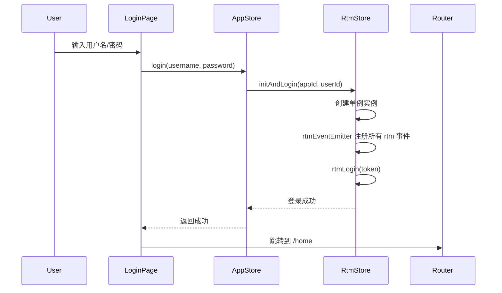
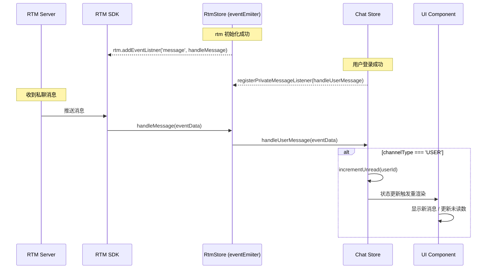
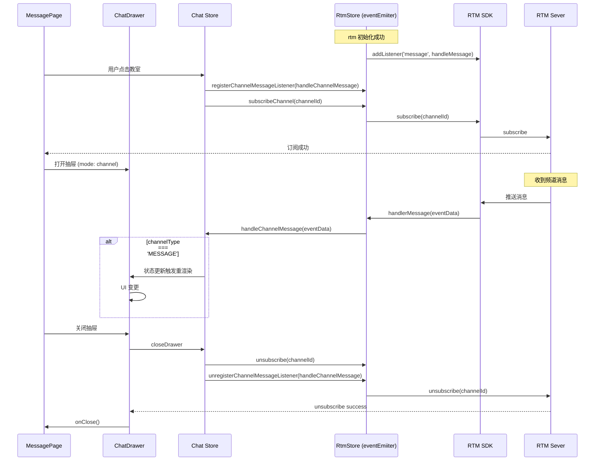
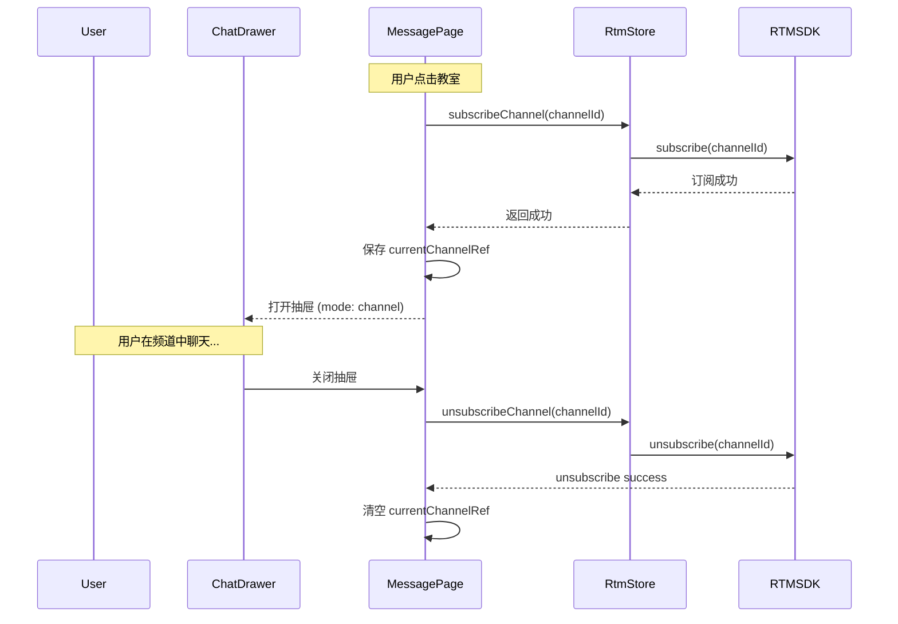
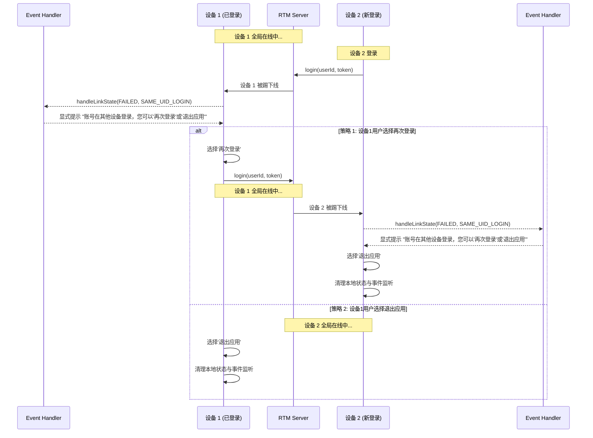

# WebRTM 接入架构设计文档

## 1. 概述

本文档提供在 web 开发中引入 Agora RTM SDK 的集成架构，提供最佳实践，帮助用户更快更好地使用声网 RTM。

### 1.1 核心目标

- ✅ **单例管理**：全局唯一 RTM 实例，避免多个实例重复登录引发未知问题
- ✅ **事件集中处理**：统一事件监听和分发机制
- ✅ **连接状态同步**：跨组件的消息和连接状态管理
- ✅ **防止互踢**：正确处理 `SAME_UID_LOGIN` 事件

---

## 2. APP 最佳实践架构

### 2.1 分层架构

```
┌─────────────────────────────────────────────────────────────────┐
│                    UI Layer (Pages & Components)                │
│  ┌──────────────┐  ┌──────────────┐  ┌──────────────┐           │
│  │  Login Page  │  │  Home Page   │  │ Message Page │           │
│  └──────────────┘  └──────────────┘  └──────┬───────┘           │
│                                             │                   │
│  ┌──────────────────────────────────────────┼──────────────┐    │
│  │  Layout（全局组件）                        │              │    │
│  │  ┌────────────────┐  ┌───────────────────▼──────────┐   │    │
│  │  │ Navbar         │  │ GlobalEventHandler           │   │    │
│  │  │ （登出/导航）    │  │ （互踢 / Token 过期 /私聊监听）  │  │    │
│  │  └────────────────┘  └──────────────────────────────┘   │    │
│  └─────────────────────────────────────────────────────────┘    │
└─────────┼───────────────────────────────────────┼───────────────┘
          │                                       │
┌─────────┼───────────────────────────────────────┼────────────────┐
│         │    State Layer (Zustand Stores)       │                │
│  ┌──────▼───────┐  ┌──────────────┐  ┌──────────▼─────┐          │
│  │  App Store   │  │  User Store  │  │  Chat Store    │          │
│  │  (登录/登出)  │  │  (用户状态)   │   │  (消息/业务)    │          │
│  └──────┬───────┘  └──────────────┘  └─────────┬──────┘          │
│         │                                      │                 │
│  ┌──────▼──────────────────────────────────────▼──────┐          │
│  │              RTM Store（薄封装层）                   │          │
│  │  - 事件监听器注册/清理                                │          │
│  │  - RTM 操作封装（消息 / 订阅 / 登录 / 登出）           │           │
│  │  - 状态检查                                         │          │
│  └──────┬──────────────────────────────────────────────┘         │
└─────────┼────────────────────────────────────────────────────────┘
          │
┌─────────▼────────────────────────────────────────────────────────┐
│              RTM Layer (shared/rtm + shared/utils/auth)          │
│  ┌──────────────┐  ┌──────────────┐  ┌──────────────┐            │
│  │ RTM Client   │  │ Event Emitter│  │ Message API  │            │
│  │  (Singleton) │  │  (EventBus)  │  │ Channel API  │            │
│  └──────────────┘  └──────────────┘  └──────────────┘            │
└──────────────────────────────────────────────────────────────────┘
```

### 2.2 核心组件

| 组件                   | 职责                                                      | 位置                                           |
| ---------------------- | --------------------------------------------------------- | ---------------------------------------------- |
| **RTM Store**          | RTM 操作薄封装层（引入自 `shared/rtm`，提供事件监听注册） | `nextjs/store/rtm.ts`                          |
| **App Store**          | 应用级状态管理（登录/登出）                               | `nextjs/store/app.ts`                          |
| **Chat Store**         | 消息状态管理 + 业务逻辑                                   | `nextjs/store/chat.ts`                         |
| **User Store**         | 用户状态管理                                              | `nextjs/store/user.ts`                         |
| **GlobalEventHandler** | 全局事件处理（互踢/Token 过期/私聊监听）                  | `nextjs/app/components/GlobalEventHandler.tsx` |
| **Navbar**             | 全局导航栏（登出）                                        | `nextjs/app/components/Navbar.tsx`             |

### 2.3 消息监听策略 ⭐

本架构采用**分层监听策略**，根据消息类型的特点采用不同的监听生命周期：

| 消息类型               | 监听时机       | 生命周期             | 注册位置                                | 处理函数               |
| ---------------------- | -------------- | -------------------- | --------------------------------------- | ---------------------- |
| **私有消息 (USER)**    | 登录成功后     | 伴随 App 生命周期    | `app/components/GlobalEventHandler.tsx` | `handleUserMessage`    |
| **频道消息 (MESSAGE)** | 打开频道聊天时 | 仅在聊天窗口打开期间 | `store/chat.ts` (openChannelChat)       | `handleChannelMessage` |

#### 设计理由

**私有消息 - 全局监听**：

- ✅ 用户随时可能收到私聊消息
- ✅ 需要实时更新未读数和消息列表
- ✅ 即使用户不在聊天界面，也要接收并存储消息
- ✅ 在 GlobalEventHandler 中注册，伴随 Layout 生命周期

**频道消息 - 按需监听**：

- ✅ 仅在用户主动进入频道时才需要接收
- ✅ 离开频道后取消监听，节省资源
- ✅ 避免接收用户未订阅频道的消息
- ✅ 在 Chat Store 的 openChannelChat 方法中注册，closeChat 时清理

#### 实现示例

```typescript
// 1. GlobalEventHandler - 注册私有消息监听（全局生命周期）
// app/components/GlobalEventHandler.tsx
export default function GlobalEventHandler() {
  const registerPrivateMessageListener = useChatStore(
    (s) => s.registerPrivateMessageListener
  );
  const unregisterPrivateMessageListener = useChatStore(
    (s) => s.unregisterPrivateMessageListener
  );

  useEffect(() => {
    // 登录后，全局监听私聊消息
    registerPrivateMessageListener();

    return () => {
      unregisterPrivateMessageListener();
    };
  }, []);

  // ... 其他逻辑
}

// 2. Chat Store - 打开频道聊天时注册频道消息监听
// store/chat.ts
openChannelChat: async (channelId) => {
  const rtmStore = useRtmStore.getState();

  try {
    // 订阅前先注册监听器
    get().registerChannelMessageListener();

    // 订阅频道
    await rtmStore.subscribeChannel(channelId);

    // 记录当前频道
    set({ currentChannelId: channelId });
  } catch (error) {
    console.error("Failed to open channel chat:", error);
    throw error;
  }
},

// 3. Chat Store - 关闭聊天时清理频道消息监听
closeChat: async (mode) => {
  if (mode === "channel") {
    const rtmStore = useRtmStore.getState();
    const { currentChannelId } = get();

    if (currentChannelId) {
      try {
        // 先取消监听器
        get().unregisterChannelMessageListener();

        // 取消订阅频道
        await rtmStore.unsubscribeChannel(currentChannelId);

        // 清空当前频道
        set({ currentChannelId: null });
      } catch (error) {
        console.error("Failed to close channel chat:", error);
        throw error;
      }
    }
  }
},
```

---

## 3. 流程图

### 3.1 登录流程


```mermaid
sequenceDiagram
    participant User
    participant LoginPage
    participant AppStore
    participant RtmStore
    participant Router

    User->>LoginPage: 输入用户名/密码
    LoginPage->>AppStore: login(username, password)
    AppStore->>RtmStore: initAndLogin(appId, userId)
    RtmStore->>RtmStore: 创建单例实例
    RtmStore->>RtmStore: rtmEventEmitter 注册所有 rtm 事件
    RtmStore->>RtmStore: rtmLogin(token)
    RtmStore-->>AppStore: 登录成功
    AppStore-->>LoginPage: 返回成功
    LoginPage->>Router: 跳转到 /home
```

### 3.2 私有消息接收流程


```mermaid
sequenceDiagram
    participant RTMServer as RTM Server
    participant RTMClient as RTM SDK
    participant RtmStore as RtmStore (eventEmiiter)
    participant ChatStore as Chat Store
    participant UI as UI Component

    Note over RtmStore: rtm 初始化成功
    RtmStore-->>RTMClient: rtm.addEventListner('message', handleMessage);

    Note over ChatStore: 用户登录成功
    ChatStore-->>RtmStore: registerPrivateMessageListener(handleUserMessage)


    Note over RTMServer: 收到私聊消息
    RTMServer->>RTMClient: 推送消息
    RTMClient->>RtmStore: handleMessage(eventData)
    RtmStore->>ChatStore: handleUserMessage(eventData)

    alt channelType === 'USER'
        ChatStore->>ChatStore: incrementUnread(userId)
        ChatStore->>UI: 状态更新触发重渲染
        UI->>UI: 显示新消息 / 更新未读数
    end
```

### 3.3 频道消息接收流程


```mermaid
sequenceDiagram

    participant MessagePage
    participant ChatDrawer
    participant ChatStore as Chat Store
    participant RtmStore as RtmStore (eventEmiiter)
    participant RTMSDK as RTM SDK
    participant RTMServer as RTM Sever

    Note over RtmStore: rtm 初始化成功
    RtmStore->>RTMSDK: addListener('message', handleMessage)
    MessagePage->>ChatStore: 用户点击教室
    ChatStore->>RtmStore: registerChannelMessageListener(handleChannelMessage)
    ChatStore->>RtmStore: subscribeChannel(channelId)
    RtmStore->>RTMSDK: subscribe(channelId)
    RTMSDK->>RTMServer: subscribe
    RTMServer-->>MessagePage: 订阅成功
    MessagePage->>ChatDrawer: 打开抽屉 (mode: channel)

    Note over RTMServer: 收到频道消息
    RTMServer->>RTMSDK: 推送消息
    RTMSDK->>RtmStore: handlerMessage(eventData)
    RtmStore->>ChatStore: handleChannelMessage(eventData)

    alt channelType === 'MESSAGE'
        ChatStore->>ChatDrawer: 状态更新触发重渲染
        ChatDrawer->>ChatDrawer: UI 变更
    end

    MessagePage->>ChatDrawer: 关闭抽屉
    ChatDrawer->>ChatStore: closeDrawer
    ChatStore->>RtmStore: unsubscribe(channelId)
    ChatStore->>RtmStore: unregisterChannelMessageListener(handleChannelMessage)
    RtmStore ->> RTMServer: unsubscribe(channelId)
    RTMServer-->>ChatDrawer: unsubscribe success
    ChatDrawer->>MessagePage: onClose()

```

### 3.4 频道订阅流程


```mermaid
sequenceDiagram
    participant User
    participant ChatDrawer
    participant MessagePage
    participant RtmStore
    participant RTMSDK

    Note over MessagePage: 用户点击教室
    MessagePage->>RtmStore: subscribeChannel(channelId)
    RtmStore->>RTMSDK: subscribe(channelId)
    RTMSDK-->>RtmStore: 订阅成功
    RtmStore-->>MessagePage: 返回成功
    MessagePage->>MessagePage: 保存 currentChannelRef
    MessagePage-->>ChatDrawer: 打开抽屉 (mode: channel)

    Note over User,ChatDrawer: 用户在频道中聊天...

    ChatDrawer->>MessagePage: 关闭抽屉
    MessagePage->>RtmStore: unsubscribeChannel(channelId)
    RtmStore->>RTMSDK: unsubscribe(channelId)
    RTMSDK -->> MessagePage: unsubscribe success
    MessagePage->>MessagePage: 清空 currentChannelRef
```

### 3.5 多端互踢处理流程


```mermaid
sequenceDiagram
    participant EventHandler1 as Event Handler
    participant Device1 as 设备 1 (已登录)
    participant RTMServer as RTM Server
    participant Device2 as 设备 2 (新登录)
    participant EventHandler2 as Event Handler

    Note over Device1, RTMServer: 设备 1 全局在线中...

    Note over Device2: 设备 2 登录
    Device2->>RTMServer: login(userId, token)
    RTMServer->>Device1: 设备 1 被踢下线
    Device1-->>EventHandler1: handleLinkState(FAILED, SAME_UID_LOGIN)
    EventHandler1-->>Device1: 显式提示 "账号在其他设备登录，您可以'再次登录'或'退出应用'"

    alt 策略 1: 设备1用户选择再次登录
        Device1->> Device1: 选择'再次登录'
        Device1->>RTMServer: login(userId, token)
        Note over Device1, RTMServer: 设备 1 全局在线中...
        RTMServer->>Device2: 设备 2 被踢下线
        Device2-->>EventHandler2: handleLinkState(FAILED, SAME_UID_LOGIN)
        EventHandler2-->>Device2: 显式提示 "账号在其他设备登录，您可以'再次登录'或'退出应用'"
        Device2->> Device2: 选择'退出应用'
        Device2->>Device2: 清理本地状态与事件监听
    else 策略 2: 设备1用户选择退出应用
        Note over Device2, RTMServer: 设备 2 全局在线中...
        Device1->> Device1: 选择'退出应用'
        Device1->>Device1: 清理本地状态与事件监听
    end
```

---

## 4. 关键设计决策

### 4.1 RTM Store 作为薄封装层

**位置**：`store/rtm.ts`

```typescript
export const useRtmStore = create<RtmStore>((set, get) => ({
  // RTM 初始化和登录（委托给 shared/rtm）
  initAndLogin: async () => {
    const userId = useUserStore().userId;
    const token = await get().generateRTMToken();
    await initRtm(userId, token); // 委托给 shared/rtm
    set({ isLoggedIn: true });
  },

  // 事件监听器注册（封装 EventEmitter）
  registerMessageListener: (handler) => {
    rtmEventEmitter.addListener("message", handler);
  },

  unregisterMessageListener: (handler) => {
    rtmEventEmitter.removeListener("message", handler);
  },

  // 其他 RTM 操作封装...
}));
```

**设计原则**：

- ✅ **薄封装**：不重新实现逻辑，只是包装 `shared/rtm` 的方法
- ✅ **状态管理**：维护 RTM 连接状态（isInitialized, isLoggedIn）
- ✅ **事件管理**：提供统一的事件监听器注册/清理接口
- ✅ **类型安全**：提供 TypeScript 类型定义

### 4.2 App Store 管理应用级状态

**位置**：`store/app.ts`

```typescript
export const useAppStore = create<AppStore>((set, get) => ({
  login: async () => {
    const rtmStore = useRtmStore.getState();
    const userId = useUserStore.getState().userId;

    // 初始化并登录 RTM
    await rtmStore.initAndLogin();

    // 保存登录状态
    localStorage.setItem("username", userId);
    localStorage.setItem("token", "mock-token-" + Date.now());
  },

  logout: async () => {
    const rtmStore = useRtmStore.getState();

    // 登出 RTM
    await rtmStore.logout();

    // 清理本地存储
    localStorage.removeItem("token");
    localStorage.removeItem("username");
  },
}));
```

**好处**：

- ✅ **集中管理**：登录/登出逻辑集中在一个地方
- ✅ **UI 简化**：UI 层只需调用 `login()` 和 `logout()`
- ✅ **易于维护**：修改登录流程只需改一个地方

### 4.3 GlobalEventHandler 作为全局事件中心

**位置**：`app/components/GlobalEventHandler.tsx`

```typescript
export default function GlobalEventHandler() {
  const registerPrivateMessageListener = useChatStore(
    (s) => s.registerPrivateMessageListener,
  );
  const registerLinkStateListener = useRtmStore().registerLinkStateListener;

  useEffect(() => {
    // 1. 注册私有消息监听（全局生命周期）
    registerPrivateMessageListener();

    // 2. 注册 linkState 监听（处理互踢/Token过期）
    registerLinkStateListener(handleLinkState);

    return () => {
      unregisterPrivateMessageListener();
      unRegisterLinkStateListener(handleLinkState);
    };
  }, []);

  // 处理互踢、Token过期等全局事件...
}
```

**架构**：

- ✅ **全局组件**：在 Layout 中引入，伴随应用生命周期
- ✅ **集中处理**：所有全局事件（互踢、Token 过期、私聊监听）在一个组件中管理
- ✅ **自动清理**：组件卸载时自动清理所有监听器

### 4.4 Chat Store 管理业务逻辑

**位置**：`store/chat.ts`

```typescript
export const useChatStore = create<ChatStore>((set, get) => ({
  // 业务方法：发送消息
  sendMessage: async (targetId, content, mode) => {
    const rtmStore = useRtmStore.getState();
    const userId = useUserStore.getState().userId;

    if (mode === "private") {
      // 调用 RTM Store 发送
      await rtmStore.sendPrivateMessage(targetId, content);

      // 更新本地状态
      const msg = {
        /* ... */
      };
      get().addPrivateMessage(targetId, msg);
    } else {
      await rtmStore.sendChannelMessage(targetId, content);
      // 频道消息通过监听器自动添加
    }
  },

  // 业务方法：打开频道聊天
  openChannelChat: async (channelId) => {
    const rtmStore = useRtmStore.getState();

    // 1. 注册监听器
    get().registerChannelMessageListener();

    // 2. 订阅频道
    await rtmStore.subscribeChannel(channelId);

    // 3. 记录状态
    set({ currentChannelId: channelId });
  },
}));

// 消息处理器（供 RTM Store 回调）
export const handleUserMessage = (eventData: any) => {
  // 处理私聊消息，更新 Chat Store 状态
};

export const handleChannelMessage = (eventData: any) => {
  // 处理频道消息，更新 Chat Store 状态
};
```

**好处**：

- ✅ **业务封装**：UI 层不需要知道 RTM 的存在
- ✅ **状态管理**：统一管理消息状态（privateMessages, channelMessages）
- ✅ **逻辑复用**：业务方法可以在多个组件中复用

---

## 5. 防止多端互踢的最佳实践

### 5.1 问题根源

**互踢原因**：

- 每个声网签发的 AppId 下，同一 `userId` 在多个设备/浏览器标签页登录
  - App 初始化页面被执行多次，每次用同一个 userId 创建新的 RTM 实例并登录
  - App 各组件都调用了 rtm login，可能存在同实例在本地多次同时执行 login
- RTM Server 默认只保留最新登录的连接

### 5.2 解决方案

#### 方案 1：单例模式（推荐）

```typescript
// ✅ 正确：全局单例
let globalRtmClient: RTM | null = null;

export function initRtm(appId: string, userId: string): RTM {
  if (globalRtmClient) {
    console.log("RTM client already exists, reusing...");
    return globalRtmClient;
  }
  globalRtmClient = new RTM(appId, userId);
  return globalRtmClient;
}

// ❌ 错误：每次都创建新实例
export function initRtm(appId: string, userId: string): RTM {
  return new RTM(appId, userId); // 可能导致互踢！
}
```

#### 方案 2：检测并处理 SAME_UID_LOGIN

```typescript
async function exitApp() {
  await releaseRtm();
  router.push("/");
}

async function reLogin() {
  await rtmLogin(getToken()); // 重新登录，踢掉其他设备
}

function handleLinkState(eventData: RTMEvents.LinkStateEvent) {
  if (eventData.currentState === "FAILED") {
    if (eventData.reasonCode === "SAME_UID_LOGIN") {
      showKickDialog("您的账号在其他设备登录, 是否重新登录？", {
        onOk: () => {
          // 策略 A：终端用户保留当前设备，重新登录
          reLogin();
        },
        onCancel: () => {
          // 策略 B：终端用户保留新设备，退出当前设备
          exitApp();
        },
      });
    }
  }
}
```

### 5.3 完整防踢流程

```typescript
// 1. 登录时：使用单例
const client = initRtm(appId, userId); // 不会重复创建

// 2. 监听互踢事件
async function exitApp() {
  await releaseRtm();
  router.push('/');
}

async function reLogin() {
  await rtmLogin(getToken()); // 重新登录，踢掉其他设备
}

function handleSameUidLogin = () => {
  showKickDialog('您的账号在其他设备登录, 是否重新登录？', {
    onOk: () => {
      // 策略 A：保留当前设备，重新登录
      reLogin();
    },
    onCancel: () => {
      // 策略 B：保留新设备，退出当前设备
      exitApp();
    }
  });
}
rtmEventEmitter.addListener("linkState", (eventData) => {
  if (eventData.reasonCode === "SAME_UID_LOGIN") {
    // 选择策略：保留当前设备 or 保留新设备
    handleSameUidLogin();
  }
});

// 3. 登出 App 同时退出 rtm
export async function mockAppLogout() {
  rtmEventEmitter.removeAllListeners();
  await releaseRtm();
}

export default function Navbar() {
  const pathname = usePathname();
  const router = useRouter();

  const navItems = [
    { path: "/home", label: "Home", icon: "🏠" },
    { path: "/message", label: "Message", icon: "💬" },
    { path: "/more", label: "More", icon: "⋯" },
  ];

  const handleLogout = async () => {
    try {
      await mockAppLogout();
      router.push("/");
    } catch (error) {
      console.error("Logout failed:", error);
      // 即使出错也跳转到登录页
      router.push("/");
    }
  };

  return (
    <nav className="navbar">
      <div className="navbar-footer">
        <button onClick={handleLogout} className="logout-button">
          <span className="navbar-icon">🚪</span>
          <span className="navbar-label">Logout</span>
        </button>
      </div>
    </nav>
  );
}


```

---

## 6. 目录结构

```
demos/
├── shared/
│   └── rtm/
│       ├── index.ts                    # 导出所有 API
│       ├── util.ts                     # RTM 单例 + EventEmitter 封装
│       └── modules/                    # RTM 功能模块
│           ├── rtm-events.ts           # 全局事件监听器 ⭐
│           ├── login.ts                # 登录/登出逻辑
│           ├── message.ts              # 消息发送/订阅 API
│           ├── streamchannel.ts        # Stream Channel API
│           ├── presence.ts             # Presence API
│           ├── storage.ts              # Storage API
│           └── lock.ts                 # Lock API
│
└── nextjs/
    ├── app/
    │   ├── layout.tsx                  # 根布局（集成 GlobalEventHandler 和 Navbar）
    │   ├── page.tsx                    # 登录页（初始并登录 RTM）
    │   ├── globals.css                 # 全局样式
    │   ├── home/
    │   │   ├── page.tsx                # Home 页面
    │   │   └── page.css                # Home 页面样式
    │   ├── message/
    │   │   ├── page.tsx                # Message 页面（聊天功能）⭐
    │   │   └── page.css                # Message 页面样式
    │   ├── more/
    │   │   ├── page.tsx                # More 页面
    │   │   └── page.css                # More 页面样式
    │   ├── components/
    │   │   ├── GlobalEventHandler.tsx  # 全局互踢事件处理 ⭐
    │   │   ├── Navbar.tsx              # 全局导航栏
    │   │   ├── ChatDrawer.tsx          # 聊天抽屉
    │   │   ├── ClassroomList.tsx       # 教室列表组件
    │   │   ├── TeacherList.tsx         # 教师列表组件
    │   │   ├── StudentList.tsx         # 学生列表组件
    │   │   └── styles/                 # 组件样式目录
    │   ├── __tests__/                  # 测试文件
    │   │   └── page.test.jsx           # 页面测试
    │   └── test/
    │       └── setup.js                # 测试配置
    │
    ├── store/
    │   ├── app.ts                      # 应用状态（登录/登出）⭐
    │   ├── rtm.ts                      # RTM 操作薄封装层 ⭐
    │   ├── chat.ts                     # 消息状态 + handleMessage ⭐
    │   ├── user.ts                     # 用户状态
    │   └── mocks/                      # Mock 数据
    │
    ├── docs/
    │   └── NEXTJS_RTM_INTEGRATION.md   # Next.js 项目 RTM 集成文档
    │
    ├── next.config.js                  # Next.js 配置
    ├── tsconfig.json                   # TypeScript 配置
    ├── vitest.config.ts                # Vitest 测试配置
    ├── package.json                    # 项目依赖
    └── .env.example                    # 环境变量示例
```

**关键文件**：

- ⭐ `modules/rtm-events.ts`：全局事件监听器，透传到 EventEmitter
- ⭐ `GlobalEventHandler.tsx`：全局互踢事件处理组件
- ⭐ `message/page.tsx`：消息页面，业务层订阅事件
- ⭐ `store/rtm.ts`：RTM 操作薄封装层，提供事件监听注册
- ⭐ `store/app.ts`：应用级状态管理（登录/登出）
- ⭐ `store/chat.ts`：消息状态管理 + 消息处理函数

---

## 7. 使用示例

### 7.1 登录页 - 初始化 RTM （以 nextjs 框架为例）

```typescript
// app/page.tsx
"use client";

import { useState } from "react";
import { useRouter } from "next/navigation";
import { useUserStore } from "@/store/user";
import { useAppStore } from "@/store/app";

export default function Login() {
  const userId = useUserStore((s) => s.userId);
  const setUserId = useUserStore((s) => s.setUserId);
  const login = useAppStore((s) => s.login);

  const [loading, setLoading] = useState(false);
  const router = useRouter();

  const handleLogin = async (e: React.FormEvent) => {
    e.preventDefault();
    setLoading(true);

    try {
      // 调用 App Store 的 login 方法
      await login();

      // 跳转到主页
      router.push("/home");
    } catch (err) {
      console.error("Login failed:", err);
    } finally {
      setLoading(false);
    }
  };

  return (
    <form onSubmit={handleLogin}>
      <input value={userId} onChange={(e) => setUserId(e.target.value)} />
      <button type="submit" disabled={loading}>
        Login
      </button>
    </form>
  );
}
```

### 7.2 GlobalEventHandler - 全局事件处理

```typescript
// app/components/GlobalEventHandler.tsx
"use client";

import { useEffect, useMemo, useState } from "react";
import { useRouter } from "next/navigation";
import { useRtmStore, RTMEvents } from "@/store/rtm";
import { useChatStore } from "@/store/chat";

export default function GlobalEventHandler() {
  const router = useRouter();
  const [showKickDialog, setShowKickDialog] = useState(false);

  const rtmLogin = useRtmStore().rtmLogin;
  const registerPrivateMessageListener = useChatStore(
    (s) => s.registerPrivateMessageListener,
  );
  const unregisterPrivateMessageListener = useChatStore(
    (s) => s.unregisterPrivateMessageListener,
  );
  const registerLinkStateListener = useRtmStore().registerLinkStateListener;
  const unRegisterLinkStateListener = useRtmStore().unRegisterLinkStateListener;

  // ⭐ 处理 linkState 事件（互踢、Token过期）
  const handleLinkState = useMemo(() => {
    return async (eventData: RTMEvents.LinkStateEvent) => {
      const { currentState, reasonCode } = eventData;

      // 处理互踢
      if (currentState === "FAILED" && reasonCode === "SAME_UID_LOGIN") {
        setShowKickDialog(true);
      }

      // 处理 Token 过期
      if (currentState === "FAILED" && reasonCode === "TOKEN_EXPIRED") {
        // store 中保证获取新 token 后再调用 rtm sdk login
        await rtmLogin();
      }
    };
  }, []);

  useEffect(() => {
    // 1. 注册私有消息监听（全局生命周期）
    registerPrivateMessageListener();

    // 2. 注册 linkState 监听（处理互踢/Token过期）
    registerLinkStateListener(handleLinkState);

    return () => {
      unregisterPrivateMessageListener();
      unRegisterLinkStateListener(handleLinkState);
    };
  }, []);

  const handleRelogin = async () => {
    try {
      await rtmLogin();
      setShowKickDialog(false);
    } catch (error) {
      console.error("重新登录失败:", error);
    }
  };

  const handleDismiss = () => {
    setShowKickDialog(false);
    router.push("/");
  };

  if (!showKickDialog) {
    return null;
  }

  return (
    <div className="kick-dialog-overlay">
      <div className="kick-dialog">
        <h2>⚠️ 账号在其他设备登录</h2>
        <p>检测到您的账号在其他设备登录，当前连接已断开。</p>
        <div className="kick-dialog-buttons">
          <button onClick={handleDismiss}>我知道了</button>
          <button onClick={handleRelogin}>再次登录</button>
        </div>
      </div>
    </div>
  );
}
```

**关键点**：

- ✅ 在 layout.tsx 中全局引入，所有页面都会加载
- ✅ 注册私有消息监听（全局生命周期）
- ✅ 检测到 `SAME_UID_LOGIN` 时显示对话框提示终端用户
- ✅ 自动处理 Token 过期，重新登录
- ✅ 提供两个选项："我知道了"（跳转登录页）和"再次登录"（踢掉其他设备）

### 7.3 Layout - 集成全局组件

```typescript
// app/layout.tsx
"use client";

import { usePathname } from "next/navigation";
import Navbar from "./components/Navbar";
import GlobalEventHandler from "./components/GlobalEventHandler";
import "./globals.css";

export default function RootLayout({
  children,
}: {
  children: React.ReactNode;
}) {
  const pathname = usePathname();

  // 登录页面不显示导航栏
  const showNavbar = pathname !== "/";

  return (
    <html lang="en">
      <body>
        {/* ⭐ 全局事件处理（私聊监听、互踢、Token过期） */}
        <GlobalEventHandler />
        {/* ⭐ 全局导航栏（登录后显示） */}
        {showNavbar && <Navbar />}
        <main style={showNavbar ? { marginLeft: "200px" } : {}}>
          {children}
        </main>
      </body>
    </html>
  );
}
```

### 7.4 Message 页 - 使用 Chat Store

```typescript
// app/message/page.tsx
"use client";

import { useEffect, useState } from "react";
import { useRouter } from "next/navigation";
import { useChatStore } from "../../store/chat";
import { useRtmStore } from "../../store/rtm";

export default function Message() {
  const router = useRouter();
  const checkRtmStatus = useRtmStore((s) => s.checkRtmStatus);
  const openPrivateChat = useChatStore((s) => s.openPrivateChat);
  const openChannelChat = useChatStore((s) => s.openChannelChat);
  const closeChat = useChatStore((s) => s.closeChat);
  const sendMessage = useChatStore((s) => s.sendMessage);

  useEffect(() => {
    // RTM 不存在
    if (!checkRtmStatus()) {
      router.push("/");
    }
  }, [router, checkRtmStatus]);

  const handlePrivateChatClick = (teacher: Teacher) => {
    // 打开私聊（清零未读数）
    openPrivateChat(teacher.userId);

    setDrawerState({
      isOpen: true,
      mode: "private",
      targetId: teacher.userId,
      targetName: teacher.name,
    });
  };

  const handleClassroomClick = async (classroom: Classroom) => {
    try {
      // 打开频道聊天（订阅 + 注册监听器）
      await openChannelChat(classroom.id);

      setDrawerState({
        isOpen: true,
        mode: "channel",
        targetId: classroom.id,
        targetName: classroom.name,
      });
    } catch (error) {
      console.error("Failed to open channel chat:", error);
    }
  };

  const handleCloseDrawer = async () => {
    try {
      // 关闭聊天（取消订阅 + 清理监听器）
      await closeChat(drawerState.mode);

      setDrawerState({ ...drawerState, isOpen: false });
    } catch (error) {
      console.error("Failed to close chat:", error);
    }
  };

  const handleSendMessage = async (content: string) => {
    try {
      // 发送消息（通过 Chat Store）
      await sendMessage(drawerState.targetId, content, drawerState.mode);
    } catch (error) {
      console.error("Failed to send message:", error);
    }
  };

  return <div>Message Content</div>;
}
```

**注意**：

- ✅ UI 层不直接调用 RTM API
- ✅ 所有操作通过 Chat Store 完成
- ✅ Chat Store 内部调用 RTM Store

### 7.5 ChatDrawer - 纯展示组件

```typescript
// app/components/ChatDrawer.tsx
"use client";

import { useState, useEffect, useRef } from "react";
import type { ChatDrawerState } from "../../types/chat";
import { useChatStore } from "../../store/chat";

export default function ChatDrawer({
  state,
  currentUserId,
  onClose,
  onSendMessage,
}: ChatDrawerProps) {
  const [inputValue, setInputValue] = useState("");
  const messagesEndRef = useRef<HTMLDivElement>(null);

  const privateMessages = useChatStore((s) => s.privateMessages);
  const channelMessages = useChatStore((s) => s.channelMessages);

  const messages =
    state.mode === "private"
      ? privateMessages[state.targetId] || []
      : channelMessages[state.targetId] || [];

  // 自动滚动到底部
  useEffect(() => {
    messagesEndRef.current?.scrollIntoView({ behavior: "smooth" });
  }, [messages]);

  const handleSend = () => {
    if (!inputValue.trim()) return;
    onSendMessage(inputValue.trim());
    setInputValue("");
  };

  return (
    <div className="chat-drawer">
      <div className="messages">
        {messages.map((msg) => (
          <div key={msg.id}>{msg.content}</div>
        ))}
        <div ref={messagesEndRef} />
      </div>

      <div className="input-area">
        <input
          value={inputValue}
          onChange={(e) => setInputValue(e.target.value)}
        />
        <button onClick={handleSend}>Send</button>
      </div>
    </div>
  );
}
```

**注意**：

- ✅ 纯展示组件，不包含任何 RTM 逻辑
- ✅ 通过 props 接收回调函数
- ✅ 从 Chat Store 读取消息状态

### 7.6 Navbar - 登出处理

```typescript
// app/components/Navbar.tsx
"use client";

import { useRouter } from "next/navigation";
import { useAppStore } from "@/store/app";

export default function Navbar() {
  const router = useRouter();
  const logout = useAppStore((s) => s.logout);

  const handleLogout = async () => {
    try {
      // 调用 App Store 的 logout 方法
      await logout();

      router.push("/");
    } catch (error) {
      console.error("Logout failed:", error);
      router.push("/");
    }
  };

  return (
    <nav className="navbar">
      <button onClick={handleLogout}>Logout</button>
    </nav>
  );
}
```

**注意**：

- ✅ UI 层只调用 App Store 的 logout 方法
- ✅ App Store 内部处理所有清理逻辑（取消监听、登出 RTM、清理存储）

---

## 8. 常见问题

### Q1: 为什么私有消息和频道消息要分开监听？

**A**: 基于不同的业务需求和生命周期：

- **私有消息**：用户随时可能收到，需要全局监听以实时更新未读数
- **频道消息**：仅在用户主动进入频道时才需要，按需监听节省资源

这种设计符合用户预期，也更高效。

### Q2: 为什么要使用 EventEmitter？

**A**: 解耦 SDK 和业务逻辑。

- RTM SDK 的事件监听器是全局的，直接在组件中注册会导致重复注册
- EventEmitter 作为中间层，允许多个组件订阅同一事件
- 组件卸载时可以安全地取消订阅，不影响其他组件

### Q3: 如何避免多端互踢？

**A**: 三个关键点：

1. 使用单例模式，全局只创建一个 RTM 实例
2. **监听 `linkState` 事件，检测 `SAME_UID_LOGIN`**
3. 页面切换时复用实例，不要重复登录。（使用 rtmStore 即可保证）

**实现示例**（已在 app/components/GlobalEventHandler.tsx 页面中实现）：

```typescript
export default function GlobalEventHandler() {
  const router = useRouter();
  const [showKickDialog, setShowKickDialog] = useState(false);
  const rtmLogin = useRtmStore().rtmLogin;
  const registerPrivateMessageListener = useChatStore(
    (s) => s.registerPrivateMessageListener,
  );
  const unregisterPrivateMessageListener = useChatStore(
    (s) => s.unregisterPrivateMessageListener,
  );
  const registerLinkStateListener = useRtmStore().registerLinkStateListener;
  const unRegisterLinkStateListener = useRtmStore().unRegisterLinkStateListener;

  const handleLinkState = useMemo(() => {
    return async (eventData: RTMEvents.LinkStateEvent) => {
      const { currentState, reasonCode } = eventData;

      if (currentState === "FAILED" && reasonCode === "SAME_UID_LOGIN") {
        // 显示互踢提示框
        setShowKickDialog(true);
      }

      // token 过期，需要重新登录
      if (currentState === "FAILED" && reasonCode === "TOKEN_EXPIRED") {
        await rtmLogin();
      }

      // 其他处理
    };
  }, []);

  useEffect(() => {
    // 全局监听私聊消息
    registerPrivateMessageListener();

    // 全局监听 linkState 事件，处理互踢
    registerLinkStateListener(handleLinkState);

    return () => {
      unregisterPrivateMessageListener();
      unRegisterLinkStateListener(handleLinkState);
    };
  }, []);

  const handleRelogin = async () => {
    try {
      await rtmLogin();
      setShowKickDialog(false);
      console.log("重新登录成功");
    } catch (error) {
      console.error("重新登录失败:", error);
      alert("重新登录失败，请刷新页面重试");
    }
  };

  const handleDismiss = () => {
    setShowKickDialog(false);
    router.push("/");
  };

  return (
    <>
      {showKickDialog && (
        <div className="kick-dialog-overlay">
          <div className="kick-dialog">
            <h2>⚠️ 账号在其他设备登录</h2>
            <p>检测到您的账号在其他设备登录，当前连接已断开。</p>
            <div className="kick-dialog-buttons">
              <button onClick={handleDismiss} className="btn-secondary">
                我知道了
              </button>
              <button onClick={handleRelogin} className="btn-primary">
                再次登录
              </button>
            </div>
          </div>
        </div>
      )}
    </>
  );
}
```

**用户选择**：

- **"我知道了"**：关闭对话框，保留新设备的登录
- **"再次登录"**：调用 `rtmLogin()` 重新登录，踢掉其他设备

---

## 9. 总结

### 9.1 架构优势

| 优势             | 说明                                                                 |
| ---------------- | -------------------------------------------------------------------- |
| **单例管理**     | 全局唯一 RTM 实例，避免重复登录和互踢                                |
| **分层监听**     | 私有消息全局监听，频道消息按需监听                                   |
| **事件解耦**     | EventEmitter 解耦 SDK 和业务，灵活订阅                               |
| **集中处理**     | 所有 RTM SDK 事件在 `rtm-events.ts` 中统一注册，由 EventEmitter 派发 |
| **状态同步**     | Zustand 跨组件共享消息状态                                           |
| **生命周期清晰** | 组件级别的事件订阅，自动清理                                         |
| **资源优化**     | 按需监听频道消息，节省资源                                           |
| **易于测试**     | 业务逻辑和 SDK 分离，便于 Mock 测试                                  |

### 9.2 最佳实践清单

**RTM 实例管理**：

- ✅ 使用单例模式管理 RTM 实例
- ✅ 在 `shared/rtm/rtm-events.ts` 中注册全局事件监听器
- ✅ 页面切换时复用实例，不要重复登录
- ✅ **使用 GlobalEventHandler 组件全局监听 `linkState` 事件处理互踢**
- ✅ 在 layout.tsx 中引入 GlobalEventHandler，所有页面自动生效
- ✅ 收到掉线通知时，提供用户选择："我知道了，回到首页" 或 "再次登录"

**消息监听策略**：

- ✅ 私有消息在登录成功后立即注册全局监听
- ✅ 频道消息订阅频道时按需监听
- ✅ 组件卸载时取消事件订阅，防止内存泄漏
- ✅ 使用不同的处理函数区分消息类型

### 9.3 架构图总结

```
登录流程：
Login Page → rtm 封装层: initRtm() / 注册全局监听 → 业务层: 注册私有消息监听 / 注册互踢掉线监听 → Home Page

全局互踢处理：
GlobalEventHandler (layout.tsx) → 监听 linkState → 检测 SAME_UID_LOGIN → 显示对话框

私有消息流程：
RTM Server → SDK → SDK Events → EventEmitter → handleUserMessage → Chat Store → UI

频道消息流程：
打开频道 → 注册频道消息监听 → subscribeChannel() →
RTM Server → SDK → SDK Events → EventEmitter → handleChannelMessage → Chat Store → UI →
关闭频道 → 取消监听 → unsubscribeChannel()
```

---

**文档版本**：v1.0  
**最后更新**：2026-01-29  
**维护者**：AI Agent
