# WebRTM 接入架构设计文档

## 1. 概述

本文档描述 Next.js 项目中 Agora RTM SDK 的集成架构，提供最佳实践以避免多端互踢问题。

### 1.1 核心目标

- ✅ **单例管理**：全局唯一 RTM 实例，避免重复登录
- ✅ **事件集中处理**：统一事件监听和分发机制
- ✅ **状态同步**：跨组件的消息和连接状态管理
- ✅ **防止互踢**：正确处理 `SAME_UID_LOGIN` 事件

---

## 2. 架构设计

### 2.1 分层架构

```
┌─────────────────────────────────────────────────────────┐
│                    UI Layer (Pages)                     │
│  ┌──────────────┐  ┌──────────────┐  ┌──────────────┐   │
│  │  Login Page  │  │  Home Page   │  │ Message Page │   │
│  └──────┬───────┘  └──────────────┘  └───────┬──────┘   │
│         │                                    │          │
│  ┌──────┴───────────────────────────────┬────┴──────┐   │
│  │  GlobalEventHandler(互踢处理)         │ ChatDrawer │  │
│  └──────────────────────────────────────┴───────────┘   │
└─────────┼─────────────────────────────────────┼─────────┘
          │                                     │
┌─────────┼─────────────────────────────────────┼──────────┐
│         │    State Layer (Zustand Stores)     │          │
│  ┌──────▼───────┐  ┌──────▼───────┐  ┌───────▼──────┐    │
│  │  User Store  │  │  Chat Store  │  │ Other Stores │    │
│  └──────┬───────┘  └──────┬───────┘  └──────┬───────┘    │
│         │                 │                 │            │
└─────────┼─────────────────┼─────────────────┼────────────┘
          │                 │                 │
┌─────────┼─────────────────┼─────────────────┼────────────┐
│         │    RTM Layer (shared/rtm)         │            │
│  ┌──────▼───────┐  ┌──────▼───────┐  ┌──────▼───────┐    │
│  │ RTM Client   │  │ Event Emitter│  │ Message API  │    │
│  │  (Singleton) │  │  (EventBus)  │  │ Channel API  │    │
│  └──────────────┘  └──────────────┘  └──────────────┘    │
└──────────────────────────────────────────────────────────┘
```

### 2.2 核心组件

| 组件                   | 职责                      | 位置                                           |
| ---------------------- | ------------------------- | ---------------------------------------------- |
| **RTM Client**         | 单例 RTM 实例管理         | `shared/rtm/util.ts`                           |
| **RTM Events**         | 全局事件监听器（SDK 层）  | `shared/rtm/rtm-events.ts`                     |
| **Event Emitter**      | 事件总线，解耦 SDK 和业务 | `shared/rtm/util.ts`                           |
| **Message API**        | 消息发送/订阅封装         | `shared/rtm/message.ts`                        |
| **Chat Store**         | 消息状态管理 + 消息处理器 | `nextjs/store/chat.ts`                         |
| **User Store**         | 用户状态管理              | `nextjs/store/user.ts`                         |
| **GlobalEventHandler** | 全局互踢事件处理          | `nextjs/app/components/GlobalEventHandler.tsx` |
| **Navbar**             | 全局导航栏                | `nextjs/app/components/Navbar.tsx`             |

### 2.3 消息监听策略 ⭐

本架构采用**分层监听策略**，根据消息类型的特点采用不同的监听生命周期：

| 消息类型               | 监听时机       | 生命周期             | 注册位置                        | 处理函数               |
| ---------------------- | -------------- | -------------------- | ------------------------------- | ---------------------- |
| **私有消息 (USER)**    | 登录成功后     | 伴随 App 生命周期    | `app/page.tsx` (登录页)         | `handleUserMessage`    |
| **频道消息 (MESSAGE)** | 打开频道聊天时 | 仅在聊天窗口打开期间 | `app/components/ChatDrawer.tsx` | `handleChannelMessage` |

#### 设计理由

**私有消息 - 全局监听**：

- ✅ 用户随时可能收到私聊消息
- ✅ 需要实时更新未读数和消息列表
- ✅ 即使用户不在聊天界面，也要接收并存储消息
- ✅ 在登录成功后立即注册，直到用户登出

**频道消息 - 按需监听**：

- ✅ 仅在用户主动进入频道时才需要接收
- ✅ 离开频道后取消监听，节省资源
- ✅ 避免接收用户未订阅频道的消息
- ✅ 在订阅频道前监听，防止漏掉消息，在 ChatDrawer 组件卸载时清理

#### 实现示例

```typescript
// 1. 登录页 - 注册私有消息监听
// app/page.tsx
const handleLogin = async () => {
  await mockLogin(userId, password);

  // 登录成功后，立即监听私有消息
  rtmEventEmitter.addListener("message", handleUserMessage);

  router.push("/dashboard");
};

// 2. 加入频道前 - 注册频道消息监听
// app/dashboard/page.tsx
const handleClassroomClick = async (classroom: Classroom) => {
  // 订阅前监听，确保不漏消息
  rtmEventEmitter.addListener("message", handleChannelMessage);

  await subscribeChannel(classroom.id);
};
// app/components/ChatDrawer.tsx
useEffect(() => {
  return () => {
    // 关闭时清理
    rtmEventEmitter.removeListener("message", handleChannelMessage);
  };
}, []);
// unsubscribe 调用前清理
const handleCloseDrawer = async (classroom: Classroom) => {
  rtmEventEmitter.removeListener("message", handleChannelMessage);
  await unsubscribeChannel(classroom.id);
};
```

---

## 3. 流程图

### 3.1 登录流程

```mermaid
sequenceDiagram
    participant User
    participant LoginPage
    participant AuthUtil
    participant RTMClient
    participant UserStore
    participant Router

    User->>LoginPage: 输入用户名/密码
    LoginPage->>AuthUtil: mockLogin(username, password)
    AuthUtil->>RTMClient: initRtm(appId, userId)
    RTMClient->>RTMClient: 创建单例实例
    RTMClient->>RTMClient: initRtmEvents() 注册全局监听
    RTMClient->>RTMClient: rtmLogin(token)
    RTMClient-->>AuthUtil: 登录成功
    AuthUtil->>UserStore: setUserId(userId)
    AuthUtil-->>LoginPage: 返回成功
    LoginPage->>Router: 跳转到 /home
```



### 3.2 私有消息接收流程

```mermaid
sequenceDiagram
    participant RTMServer as RTM Server
    participant RTMClient as RTM Client (SDK)
    participant RTMEvents as RTM Events (全局监听)
    participant EventEmitter as Event Emitter
    participant LoginPage as Login Page
    participant ChatStore as Chat Store
    participant UI as UI Component

    Note over LoginPage: 用户登录成功
    LoginPage->>EventEmitter: addListener('message', handleUserMessage)

    Note over RTMServer: 收到私聊消息
    RTMServer->>RTMClient: 推送消息
    RTMClient->>RTMEvents: handleMessage(eventData)
    RTMEvents->>EventEmitter: emit('message', eventData)
    EventEmitter->>ChatStore: handleUserMessage(eventData)

    alt channelType === 'USER'
        ChatStore->>ChatStore: addPrivateMessage(userId, message)
        ChatStore->>ChatStore: incrementUnread(userId)
        ChatStore->>UI: 状态更新触发重渲染
        UI->>UI: 显示新消息 / 更新未读数
    end
```



### 3.3 频道消息接收流程

```mermaid
sequenceDiagram
    participant User
    participant Dashboard
    participant ChatDrawer
    participant ChatStore as Chat Store
    participant EventEmitter as Event Emitter
    participant RTMClient as RTM Client (SDK)

    User->>Dashboard: 点击教室
    Dashboard->>EventEmitter: addListener('message', handleChannelMessage)
    Dashboard->>RTMClient: subscribeChannel(channelId)
    RTMClient-->>Dashboard: 订阅成功
    Dashboard->>ChatDrawer: 打开抽屉 (mode: channel)

    Note over RTMClient: 收到频道消息
    RTMClient->>EventEmitter: emit('message', eventData)
    EventEmitter->>ChatStore: handleChannelMessage(eventData)

    alt channelType === 'MESSAGE'
        ChatStore->>ChatStore: addChannelMessage(channelId, message)
        ChatStore->>ChatDrawer: 状态更新触发重渲染
        ChatDrawer->>User: 显示新消息
    end

    User->>ChatDrawer: 关闭抽屉
    ChatDrawer->>EventEmitter: removeListener('message', handleChannelMessage)
    ChatDrawer->>Dashboard: onClose()
    Dashboard->>RTMClient: unsubscribeChannel(channelId)
```



### 3.4 频道订阅流程


### 3.5 多端互踢处理流程

```mermaid
sequenceDiagram
    participant EventHandler1 as Event Handler
    participant Device1 as 设备 1 (已登录)
    participant RTMServer as RTM Server
    participant Device2 as 设备 2 (新登录)
    participant EventHandler2 as Event Handler

    Device2->>RTMServer: login(userId, token)
    RTMServer->>Device1: 设备 1 被踢下线
    Device1-->>EventHandler1: handleLinkState(FAILED, SAME_UID_LOGIN)
    EventHandler1-->>Device1: 显式提示 "账号在其他设备登录，您可以'再次登录'或'退出应用'"

    alt 策略 1: 设备1用户选择再次登录
        Device1->> Device1: 选择'再次登录'
        Device1->>RTMServer: login(userId, token)
        RTMServer->>Device2: 设备 2 被踢下线
        Device2-->>EventHandler2: handleLinkState(FAILED, SAME_UID_LOGIN)
        EventHandler2-->>Device2: 显式提示 "账号在其他设备登录，您可以'再次登录'或'退出应用'"
        Device2->> Device2: 选择'退出应用'
        Device2->>Device2: 清理本地状态与事件监听
    else 策略 2: 设备1用户选择退出应用
        Device1->> Device1: 选择'退出应用'
        Device1->>Device1: 清理本地状态与事件监听
    end
```



---

## 4. 关键设计决策

### 4.1 RTM 实例绑定在 App 层

**位置**：`shared/rtm/util.ts`

```typescript
let globalRtmClient: RTM | null = null;

export function initRtm(appId: string, userId: string): RTM {
  if (globalRtmClient) {
    return globalRtmClient; // 返回已存在的实例
  }

  globalRtmClient = new RTM(appId, userId, { logLevel: "error" });
  initRtmEvents(); // 注册全局事件监听
  return globalRtmClient;
}

export function getGlobalRtmClient(): RTM {
  if (!globalRtmClient) {
    throw new Error("RTM client not initialized");
  }
  return globalRtmClient;
}
```

**好处**：

- ✅ 全局唯一实例，避免重复创建
- ✅ 跨页面/组件共享同一连接
- ✅ 防止因多次登录导致互踢

### 4.2 事件处理统一放在 `shared/rtm/rtm-events.ts`

**架构**：

```typescript
// 1. 全局事件监听器（SDK 层）
function handleLinkState(eventData: RTMEvents.LinkStateEvent) {
  rtmEventEmitter.emit("linkState", eventData); // 转发到业务层

  // 处理连接状态变化
  if (eventData.currentState === "FAILED") {
    if (eventData.reasonCode === "SAME_UID_LOGIN") {
      // 处理互踢逻辑
    }
  }
}

function handleMessage(eventData: RTMEvents.MessageEvent) {
  rtmEventEmitter.emit("message", eventData); // 转发到业务层
}

// 2. 注册到 RTM Client
export function initRtmEvents() {
  getGlobalRtmClient().addEventListener("linkState", handleLinkState);
  getGlobalRtmClient().addEventListener("message", handleMessage);
}
```

**好处**：

- ✅ **解耦 SDK 和业务逻辑**：业务层通过 EventEmitter 订阅，不直接依赖 SDK
- ✅ **集中处理**：所有 RTM 事件在一个文件中管理，易于维护
- ✅ **灵活订阅**：不同页面/组件可以选择性监听需要的事件
- ✅ **防止重复注册**：全局只注册一次，避免内存泄漏

### 4.3 分层消息监听策略 ⭐

本架构实现 **根据消息类型采用不同的监听策略**。

#### 私有消息 - 全局监听

**注册位置**：`app/page.tsx` (登录页)

```typescript
// app/page.tsx
const handleLogin = async () => {
  try {
    await mockLogin(userId, password);
    localStorage.setItem("token", "mock-token-" + Date.now());

    // ⭐ 登录成功后，立即注册私有消息监听
    rtmEventEmitter.addListener("message", handleUserMessage);

    router.push("/dashboard");
  } catch (err) {
    setError("Login failed. Please try again.");
  }
};
```

**处理函数**：`store/chat.ts`

```typescript
// store/chat.ts
export const handleUserMessage = (eventData: any) => {
  const { publisher, message, channelType } = eventData;

  if (channelType === "USER") {
    // 处理私聊消息
    const msg: Message = {
      id: `${Date.now()}-${Math.random()}`,
      senderId: publisher,
      senderName: publisher,
      content: message,
      timestamp: Date.now(),
    };

    useChatStore.getState().addPrivateMessage(publisher, msg);
    useChatStore.getState().incrementUnread(publisher);
  }
};
```

**好处**：

- ✅ 用户在任何页面都能接收私聊消息
- ✅ 实时更新未读数，提升用户体验
- ✅ 消息不会丢失，即使用户不在聊天界面

#### 频道消息 - 按需监听

**注册位置**：`app/dashboard/page.tsx`
**取消注册位置**：`app/components/ChatDrawer.tsx`

```typescript
// app/dashboard/page.tsx
const handleClassroomClick = async (classroom: Classroom) => {
  // 订阅前监听，确保不漏消息
  rtmEventEmitter.addListener('message', handleChannelMessage);

  await subscribeChannel(classroom.id);
}

// app/components/ChatDrawer.tsx
export default function ChatDrawer({ state, ... }: ChatDrawerProps) {
  useEffect(() => {
    return () => {
      // ⭐ 关闭时立即清理
      rtmEventEmitter.removeListener('message', handleChannelMessage);
    };
  }, []);
}
```

**处理函数**：`store/chat.ts`

```typescript
// store/chat.ts
export const handleChannelMessage = (eventData: any) => {
  const localUserId = useUserStore.getState().userId;
  const { publisher, message, channelType, channelName } = eventData;

  if (channelType === "MESSAGE") {
    // 处理频道消息
    let senderName = publisher === localUserId ? "Me" : publisher;

    const msg: Message = {
      id: `${Date.now()}-${Math.random()}`,
      senderId: publisher,
      senderName,
      content: message,
      timestamp: Date.now(),
    };

    useChatStore.getState().addChannelMessage(channelName, msg);
  }
};
```

**好处**：

- ✅ 节省资源，仅在需要时监听
- ✅ 避免接收用户未订阅频道的消息
- ✅ 组件卸载时自动清理，防止内存泄漏
- ✅ 符合用户预期：离开频道后不再接收消息

#### 对比总结

| 维度         | 私有消息             | 频道消息               |
| ------------ | -------------------- | ---------------------- |
| **监听时机** | 登录成功后           | 打开频道聊天时         |
| **生命周期** | 伴随 App（直到登出） | 伴随 ChatDrawer 组件   |
| **注册位置** | Login Page           | subscribeChannel 前    |
| **清理时机** | 用户登出             | 组件卸载 / 关闭抽屉    |
| **处理函数** | `handleUserMessage`  | `handleChannelMessage` |
| **设计目的** | 全局接收，实时提醒   | 按需接收，节省资源     |

### 4.4 业务层通过 EventEmitter 订阅

**EventEmitter 的作用**：

EventEmitter 作为事件总线，实现了 SDK 层和业务层的解耦：

```
RTM SDK → RTM Events (全局监听) → EventEmitter → 业务层 (多个订阅者)
```

**好处**：

- ✅ **一对多**：一个 SDK 事件可以被多个组件订阅
- ✅ **灵活订阅**：不同组件可以选择性监听需要的事件
- ✅ **生命周期管理**：组件可以在挂载/卸载时自由订阅/取消订阅
- ✅ **防止重复注册**：SDK 层只注册一次，业务层通过 EventEmitter 订阅

**示例**：

```typescript
// 组件 A：监听私有消息
useEffect(() => {
  rtmEventEmitter.addListener("message", handleUserMessage);
  return () => rtmEventEmitter.removeListener("message", handleUserMessage);
}, []);

// 组件 B：监听频道消息
useEffect(() => {
  rtmEventEmitter.addListener("message", handleChannelMessage);
  return () => rtmEventEmitter.removeListener("message", handleChannelMessage);
}, []);

// 两个组件可以同时监听同一个 'message' 事件，互不干扰
```

---

## 5. 防止多端互踢的最佳实践

### 5.1 问题根源

**互踢原因**：

- 同一 `userId` 在多个设备/浏览器标签页登录
- 每次登录都会创建新的 RTM 实例
- RTM Server 默认只保留最新登录的连接

### 5.2 解决方案

#### 方案 1：单例模式（推荐）

```typescript
// ✅ 正确：全局单例
let globalRtmClient: RTM | null = null;

export function initRtm(appId: string, userId: string): RTM {
  if (globalRtmClient) {
    console.log("RTM client already exists, reusing...");
    return globalRtmClient;
  }
  globalRtmClient = new RTM(appId, userId);
  return globalRtmClient;
}

// ❌ 错误：每次都创建新实例
export function initRtm(appId: string, userId: string): RTM {
  return new RTM(appId, userId); // 会导致互踢！
}
```

#### 方案 2：检测并处理 SAME_UID_LOGIN

```typescript
async function exitApp() {
  await releaseRtm();
  router.push("/");
}

async function reLogin() {
  await rtmLogin(getToken()); // 重新登录，踢掉其他设备
}

function handleLinkState(eventData: RTMEvents.LinkStateEvent) {
  if (eventData.currentState === "FAILED") {
    if (eventData.reasonCode === "SAME_UID_LOGIN") {
      showKickDialog("您的账号在其他设备登录, 是否重新登录？", {
        onOk: () => {
          // 策略 A：保留当前设备，重新登录
          reLogin();
        },
        onCancel: () => {
          // 策略 B：保留新设备，退出当前设备
          exitApp();
        },
      });
    }
  }
}
```

### 5.3 完整防踢流程

```typescript
// 1. 登录时：使用单例
const client = initRtm(appId, userId); // 不会重复创建

// 2. 监听互踢事件
async function exitApp() {
  await releaseRtm();
  router.push('/');
}

async function reLogin() {
  await rtmLogin(getToken()); // 重新登录，踢掉其他设备
}

function handleSameUidLogin = () => {
  showKickDialog('您的账号在其他设备登录, 是否重新登录？', {
    onOk: () => {
      // 策略 A：保留当前设备，重新登录
      reLogin();
    },
    onCancel: () => {
      // 策略 B：保留新设备，退出当前设备
      exitApp();
    }
  });
}
rtmEventEmitter.addListener("linkState", (eventData) => {
  if (eventData.reasonCode === "SAME_UID_LOGIN") {
    // 选择策略：保留当前设备 or 保留新设备
    handleSameUidLogin();
  }
});

// 3. 页面切换时：复用实例
useEffect(() => {
  try {
    getGlobalRtmClient(); // 获取已存在的实例
  } catch (e) {
    router.push("/"); // 未登录，跳转登录页
  }
}, []);

// 4. 登出 App 同时退出 rtm
export async function mockAppLogout() {
  rtmEventEmitter.removeAllListeners();
  await releaseRtm();
}

export default function Navbar() {
  const pathname = usePathname();
  const router = useRouter();

  const navItems = [
    { path: "/home", label: "Home", icon: "🏠" },
    { path: "/message", label: "Message", icon: "💬" },
    { path: "/more", label: "More", icon: "⋯" },
  ];

  const handleLogout = async () => {
    try {
      await mockAppLogout();
      router.push("/");
    } catch (error) {
      console.error("Logout failed:", error);
      // 即使出错也跳转到登录页
      router.push("/");
    }
  };

  return (
    <nav className="navbar">
      <div className="navbar-footer">
        <button onClick={handleLogout} className="logout-button">
          <span className="navbar-icon">🚪</span>
          <span className="navbar-label">Logout</span>
        </button>
      </div>
    </nav>
  );
}


```

---

## 6. 目录结构

```
demos/
├── shared/
│   └── rtm/
│       ├── index.ts              # 导出所有 API
│       ├── util.ts               # RTM 单例 + EventEmitter
│       ├── rtm-events.ts         # 全局事件监听器 ⭐
│       ├── login.ts              # 登录/登出逻辑
│       ├── message.ts            # 消息发送/订阅 API
│       └── streamchannel.ts      # Stream Channel API
│
└── nextjs/
│    ├── app/
│    │   ├── layout.tsx            # 根布局（集成 GlobalEventHandler 和 Navbar）
│    │   ├── page.tsx              # 登录页（初始并登录 RTM）
│    │   ├── home/
│    │   │   └── page.tsx          # Home 页面
│    │   ├── message/
│    │   │   └── page.tsx          # Message 页面（原 dashboard，聊天功能）⭐
│    │   ├── more/
│    │   │   └── page.tsx          # More 页面
│    │   └── components/
│    │       ├── GlobalEventHandler.tsx  # 全局互踢事件处理 ⭐
│    │       ├── Navbar.tsx              # 全局导航栏
│    │       └── ChatDrawer.tsx          # 聊天抽屉
│    │
│    └── store/
│        ├── user.ts               # 用户状态
│        └── chat.ts               # 消息状态 + handleMessage ⭐
└── other frameworks
```

**关键文件**：

- ⭐ `rtm-events.ts`：全局事件监听器，处理所有 RTM 事件
- ⭐ `GlobalEventHandler.tsx`：全局互踢事件处理组件
- ⭐ `message/page.tsx`：消息页面，业务层订阅事件
- ⭐ `chat.ts`：消息状态管理 + 消息处理函数

---

## 7. 使用示例

### 7.1 登录页 - 注册私有消息监听

```typescript
// app/page.tsx
"use client";

import { useState } from "react";
import { useRouter } from "next/navigation";
import { mockLogin } from "../../shared/utils/auth";
import { rtmEventEmitter } from "../../shared/rtm";
import { handleUserMessage } from "@/store/chat";

export default function Login() {
  const [userId, setUserId] = useState("");
  const [loading, setLoading] = useState(false);
  const router = useRouter();

  const handleLogin = async (e: React.FormEvent) => {
    e.preventDefault();
    setLoading(true);

    try {
      // 1. 登录 RTM
      await mockLogin(userId, "password");
      localStorage.setItem("token", "mock-token-" + Date.now());

      // 2. ⭐ 注册私有消息监听（全局生命周期）
      rtmEventEmitter.addListener("message", handleUserMessage);

      // 3. 跳转到主页
      router.push("/home");
    } catch (err) {
      console.error("Login failed:", err);
    } finally {
      setLoading(false);
    }
  };

  return (
    <form onSubmit={handleLogin}>
      <input value={userId} onChange={(e) => setUserId(e.target.value)} />
      <button type="submit" disabled={loading}>
        Login
      </button>
    </form>
  );
}
```

### 7.2 GlobalEventHandler - 全局互踢事件处理

```typescript
// app/components/GlobalEventHandler.tsx
"use client";

import { useEffect, useState } from "react";
import { useRouter, usePathname } from "next/navigation";
import { rtmEventEmitter, rtmLogin } from "../../../shared/rtm";
import "./GlobalEventHandler.css";

export default function GlobalEventHandler() {
  const router = useRouter();
  const [showKickDialog, setShowKickDialog] = useState(false);

  useEffect(() => {
    // ⭐ 监听 linkState 事件，处理互踢
    const handleLinkState = (eventData: any) => {
      const { currentState, reasonCode } = eventData;

      if (currentState === "FAILED" && reasonCode === "SAME_UID_LOGIN") {
        // 显示互踢提示框
        setShowKickDialog(true);
      }
    };

    rtmEventEmitter.addListener("linkstate", handleLinkState);

    return () => {
      rtmEventEmitter.removeListener("linkstate", handleLinkState);
    };
  }, []);

  const handleRelogin = async () => {
    try {
      await rtmLogin();
      setShowKickDialog(false);
      console.log("重新登录成功");
    } catch (error) {
      console.error("重新登录失败:", error);
      alert("重新登录失败，请刷新页面重试");
    }
  };

  const handleDismiss = () => {
    setShowKickDialog(false);
    router.push("/");
  };

  if (!showKickDialog) {
    return null;
  }

  return (
    <div className="kick-dialog-overlay">
      <div className="kick-dialog">
        <h2>⚠️ 账号在其他设备登录</h2>
        <p>检测到您的账号在其他设备登录，当前连接已断开。</p>
        <div className="kick-dialog-buttons">
          <button onClick={handleDismiss} className="btn-secondary">
            我知道了
          </button>
          <button onClick={handleRelogin} className="btn-primary">
            再次登录
          </button>
        </div>
      </div>
    </div>
  );
}
```

**关键点**：

- ✅ 在 layout.tsx 中全局引入，所有页面都会加载
- ✅ 检测到 `SAME_UID_LOGIN` 时显示对话框
- ✅ 提供两个选项："我知道了"（跳转登录页）和"再次登录"（踢掉其他设备）

### 7.3 Layout - 集成全局组件

```typescript
// app/layout.tsx
"use client";

import { usePathname } from "next/navigation";
import Navbar from "./components/Navbar";
import GlobalEventHandler from "./components/GlobalEventHandler";
import "./globals.css";

export default function RootLayout({
  children,
}: {
  children: React.ReactNode;
}) {
  const pathname = usePathname();

  // 登录页面不显示导航栏
  const showNavbar = pathname !== "/";

  return (
    <html lang="en">
      <body>
        {/* ⭐ 全局互踢事件处理 */}
        <GlobalEventHandler />
        {/* ⭐ 全局导航栏（登录后显示） */}
        {showNavbar && <Navbar />}
        <main style={showNavbar ? { marginLeft: "200px" } : {}}>
          {children}
        </main>
      </body>
    </html>
  );
}
```

### 7.4 Message 页 - 检查 RTM 状态

```typescript
// app/message/page.tsx
"use client";

import { useEffect } from "react";
import { useRouter } from "next/navigation";
import { getGlobalRtmClient } from "../../../shared/rtm";

export default function Message() {
  const router = useRouter();

  useEffect(() => {
    // 检查 RTM 是否已初始化
    try {
      getGlobalRtmClient(); // 如果未登录会抛出异常
    } catch (e) {
      router.push("/"); // 跳转到登录页
    }
  }, [router]);

  // 注意：不需要在这里订阅消息事件
  // 私有消息已在登录页注册全局监听
  // 频道消息会在 ChatDrawer 中按需监听

  return <div>Message Content</div>;
}
```

### 7.5 ChatDrawer - 注册频道消息监听

```typescript
'use client';
// app/message/page.tsx
const handleClassroomClick = async (classroom: Classroom) => {
  // 订阅前监听，确保不漏消息
  rtmEventEmitter.addListener('message', handleChannelMessage);

  await subscribeChannel(classroom.id);

  // open ChatDrawer
}

// app/components/ChatDrawer.tsx
import { useEffect } from 'react';
import { rtmEventEmitter } from '../../../shared/rtm';
import { handleChannelMessage, useChatStore } from '../../store/chat';

export default function ChatDrawer({ state, ... }: ChatDrawerProps) {
  const privateMessages = useChatStore((s) => s.privateMessages);
  const channelMessages = useChatStore((s) => s.channelMessages);

  const messages = state.mode === 'private'
    ? privateMessages[state.targetId] || []
    : channelMessages[state.targetId] || [];

  useEffect(() => {

    return () => {
      // ⭐ 组件卸载时清理
      rtmEventEmitter.removeListener('message', handleChannelMessage);
    };
  }, []);

  return (
    <div className="chat-drawer">
      {messages.map(msg => (
        <div key={msg.id}>{msg.content}</div>
      ))}
    </div>
  );
}
```

### 7.6 Chat Store - 消息处理函数

```typescript
// store/chat.ts
import { create } from "zustand";
import { useUserStore } from "./user";

export const useChatStore = create<ChatStore>((set) => ({
  privateMessages: {},
  channelMessages: {},
  unreadCounts: {},

  addPrivateMessage: (userId, message) =>
    set((state) => ({
      privateMessages: {
        ...state.privateMessages,
        [userId]: [...(state.privateMessages[userId] || []), message],
      },
    })),

  addChannelMessage: (channelId, message) =>
    set((state) => ({
      channelMessages: {
        ...state.channelMessages,
        [channelId]: [...(state.channelMessages[channelId] || []), message],
      },
    })),

  incrementUnread: (userId) =>
    set((state) => ({
      unreadCounts: {
        ...state.unreadCounts,
        [userId]: (state.unreadCounts[userId] || 0) + 1,
      },
    })),
}));

// ⭐ 私有消息处理函数（全局监听）
export const handleUserMessage = (eventData: any) => {
  const { publisher, message, channelType } = eventData;

  if (channelType === "USER") {
    const msg: Message = {
      id: `${Date.now()}-${Math.random()}`,
      senderId: publisher,
      senderName: publisher,
      content: message,
      timestamp: Date.now(),
    };

    useChatStore.getState().addPrivateMessage(publisher, msg);
    useChatStore.getState().incrementUnread(publisher);
  }
};

// ⭐ 频道消息处理函数（按需监听）
export const handleChannelMessage = (eventData: any) => {
  const localUserId = useUserStore.getState().userId;
  const { publisher, message, channelType, channelName } = eventData;

  if (channelType === "MESSAGE") {
    const msg: Message = {
      id: `${Date.now()}-${Math.random()}`,
      senderId: publisher,
      senderName: publisher === localUserId ? "Me" : publisher,
      content: message,
      timestamp: Date.now(),
    };

    useChatStore.getState().addChannelMessage(channelName, msg);
  }
};
```

### 7.7 发送消息

```typescript
import { sendMessageToUser, sendChannelMessage } from "../../../shared/rtm";

// 私聊
await sendMessageToUser(targetUserId, "Hello!");

// 频道
await sendChannelMessage(channelId, "Hello everyone!");
```

---

## 8. 常见问题

### Q1: 为什么私有消息和频道消息要分开监听？

**A**: 基于不同的业务需求和生命周期：

- **私有消息**：用户随时可能收到，需要全局监听以实时更新未读数
- **频道消息**：仅在用户主动进入频道时才需要，按需监听节省资源

这种设计符合用户预期，也更高效。

### Q2: 为什么要使用 EventEmitter？

**A**: 解耦 SDK 和业务逻辑。

- RTM SDK 的事件监听器是全局的，直接在组件中注册会导致重复注册
- EventEmitter 作为中间层，允许多个组件订阅同一事件
- 组件卸载时可以安全地取消订阅，不影响其他组件

### Q3: 如何避免多端互踢？

**A**: 三个关键点：

1. 使用单例模式，全局只创建一个 RTM 实例
2. **监听 `linkState` 事件，检测 `SAME_UID_LOGIN`**
3. 页面切换时复用实例，不要重复登录

**实现示例**（已在 Dashboard 页面实现）：

```typescript
useEffect(() => {
  const handleLinkState = (eventData: any) => {
    const { currentState, reasonCode } = eventData;

    if (currentState === "FAILED" && reasonCode === "SAME_UID_LOGIN") {
      // 显示提示框，让用户选择
      setShowKickDialog(true);
    }
  };

  rtmEventEmitter.addListener("linkState", handleLinkState);

  return () => {
    rtmEventEmitter.removeListener("linkState", handleLinkState);
  };
}, []);
```

**用户选择**：

- **"我知道了"**：关闭对话框，保留新设备的登录
- **"再次登录"**：调用 `rtmLogin()` 重新登录，踢掉其他设备

---

## 9. 总结

### 9.1 架构优势

| 优势             | 说明                                       |
| ---------------- | ------------------------------------------ |
| **单例管理**     | 全局唯一 RTM 实例，避免重复登录和互踢      |
| **分层监听**     | 私有消息全局监听，频道消息按需监听         |
| **事件解耦**     | EventEmitter 解耦 SDK 和业务，灵活订阅     |
| **集中处理**     | 所有 RTM 事件在 `rtm-events.ts` 中统一管理 |
| **状态同步**     | Zustand 跨组件共享消息状态                 |
| **生命周期清晰** | 组件级别的事件订阅，自动清理               |
| **资源优化**     | 按需监听频道消息，节省资源                 |
| **易于测试**     | 业务逻辑和 SDK 分离，便于 Mock 测试        |

### 9.2 最佳实践清单

**RTM 实例管理**：

- ✅ 使用单例模式管理 RTM 实例
- ✅ 在 `shared/rtm/rtm-events.ts` 中注册全局事件监听器
- ✅ 页面切换时复用实例，不要重复登录
- ✅ **使用 GlobalEventHandler 组件全局监听 `linkState` 事件处理互踢**
- ✅ 在 layout.tsx 中引入 GlobalEventHandler，所有页面自动生效
- ✅ 提供用户选择："我知道了" 或 "再次登录"

**消息监听策略**：

- ✅ 私有消息在登录成功后立即注册全局监听
- ✅ 频道消息订阅频道时按需监听
- ✅ 组件卸载时取消事件订阅，防止内存泄漏
- ✅ 使用不同的处理函数区分消息类型

### 9.3 架构图总结

```
登录流程：
Login Page → initRtm() → 注册全局监听 → 注册私有消息监听 → Home Page

全局互踢处理：
GlobalEventHandler (layout.tsx) → 监听 linkState → 检测 SAME_UID_LOGIN → 显示对话框

私有消息流程：
RTM Server → SDK → RTM Events → EventEmitter → handleUserMessage → Chat Store → UI

频道消息流程：
打开频道 → subscribeChannel() → 注册频道消息监听 →
RTM Server → SDK → RTM Events → EventEmitter → handleChannelMessage → Chat Store → UI →
关闭频道 → 取消监听 → unsubscribeChannel()
```

---

**文档版本**：v1.0  
**最后更新**：2026-01-29  
**维护者**：AI Agent
